# A-List Tracker — UX & Interaction Design

*All names, dates and dollar amounts in the diagrams are illustrative.*

## Design Principles

| Principle | Means |
|---|---|
| One border, not nested ones | a card gets a single bordered shell with a flat interior — never border-in-a-border |
| Phone first | one narrow column with a three-item bottom bar — Dashboard · **Calendar** · Watchlist, Calendar in the middle and the most prominent; wider screens reflow the same components, no parallel desktop layout |
| Posters are the interface | movie art carries the calendar, the lists and the drawers; on the calendar a poster runs edge to edge in its cell, like a photo calendar |
| Dreamer UI first | `Calendar` (with `renderCell`), `Form`, `Modal`, `Drawer`, `Tabs`, `Badge` — custom only where the catalog has nothing: the poster split and the star rating |
| Log in a tap or two | defaults, chips and pickers over typing; anything optional waits behind a "+ Add X" link |
| Never overlay on overlay | tapping a day opens nothing (its movies show in a panel under the grid); tapping a movie opens a `Drawer`; whatever continues inside an open drawer — Mark paid, Edit, Add to calendar from the watchlist — swaps that drawer's content in place with a "‹ Back" link. Only a destructive confirm may sit on top |
| Drawers for movie flows, modals for the rest | Add to calendar, Add to watchlist, Add past movies, the viewing details and the Seen prompt are all `Drawer`s at every width; only Setup and Membership settings are `Modal`s. This is a deliberate exception to the usual "forms are modals" default: the movie flows are a search-then-fill sequence that reads better as a sheet |
| Never offer what can't be done | "Mark seen" appears only once the showtime has ended; "Standard price" appears only for a premium format |
| Honest, kind math | negative net savings reads "Not yet" in a plain tone, never an alarm |

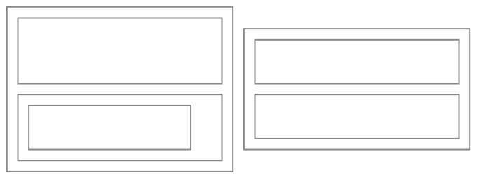
*Honest caveats: (1) Dreamer UI's `Calendar` hands `renderCell` only the date and offers no month-change callback, so cell contents come from a day-keyed lookup the app builds up front, not a per-cell fetch. (2) Edge-to-edge posters need the calendar's own cell padding and border cleared and its cells made taller than square (about 3:4, so a 2:3 poster fills them with a light crop) through `customStyles`; whether the component lets cell height be set that freely is the first thing to prove out when building. The cost of taller cells is fewer rows on screen, which is why the day panel scrolls into view when a day is tapped.*

## Sitemap

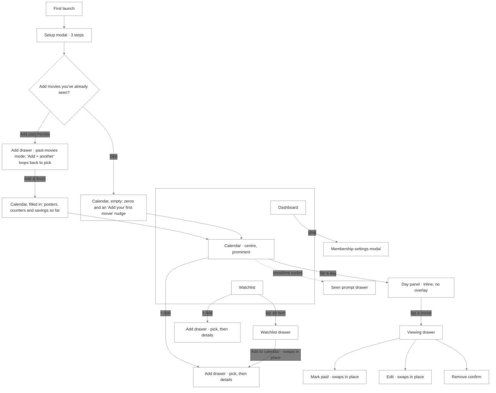
*Past movies and skipping differ only in what the Calendar opens to: with them it's already populated and the savings tiles already have numbers; without them it's empty and every counter starts at zero. Nothing is lost by skipping — a movie on a past date can be added any time with "+ Add" and is saved as Seen the same way. The empty Calendar's nudge offers "Add your first movie" and, for anyone who skipped, "Add past movies" to start the same loop later (an addition).*

## Screens

*The persistent shell, shown once and left out of the screens below:*

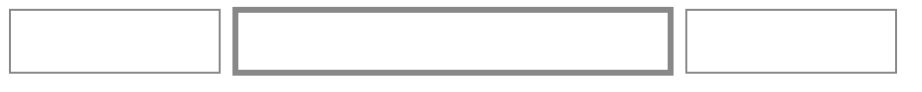
*Calendar sits in the middle, wider and filled or raised so it reads as home; the app opens to it. The active tab takes the accent colour.*

**Setup — Cost & start date** (modal, step 2 of 3 shown; step 1 confirms the perks, step 3 sets the goals)
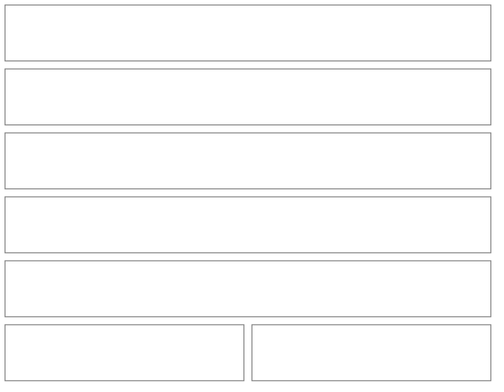

| Bill total | What you see | What gets saved |
|---|---|---|
| left blank | no rate line; Next still enables | the monthly total equals the cost before tax, and no tax rate; ticket tax chips start empty and fill in from your tickets |
| entered, at least the cost | the rate it implies updates as you type | the bill total as your monthly total, and the implied rate (rounded to four decimals) |
| entered, below the cost | an inline note that a bill can't be lower than the cost before tax | nothing; Next stays disabled |

| Start date | What you see | What gets saved |
|---|---|---|
| required; today or earlier | a date field defaulting to nothing, so it has to be chosen | the day itself, which fixes your billing day |

*The start date isn't optional: it fixes your billing day, so cost so far and break-even are counted from the right month, and it's the earliest date a past movie can be given. There's no free source for local tax rates, so the app gauges yours from your own bill instead and, from then on, follows what you actually use on tickets (see Ticket). Steps: Membership (confirm perks) → Cost & start date → Goals. A stepper earns its place here because it's first-run only and each step feeds the next.*

**Calendar** (home tab)
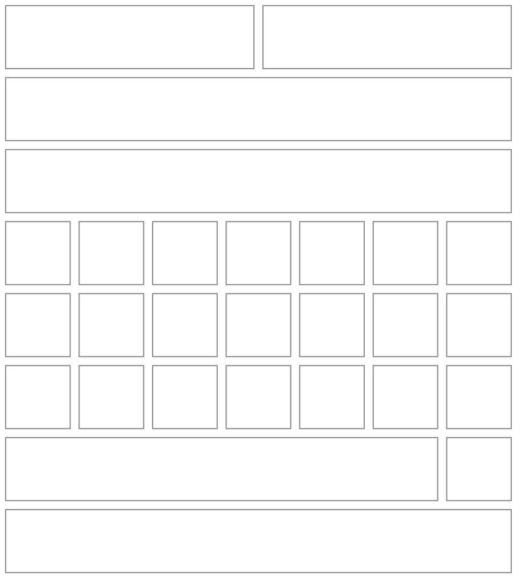
*Month view only. In the real grid the posters fill their whole cell, with the date number small in a corner over a soft shade; a day with nothing on it is a plain cell. Selected is a ring, today an accent on its number. There is no "planned" badge: anything on a future date is planned by definition, and the counters count seen movies only. Tapping a day shows its movies in the panel under the grid (never an overlay); tapping a movie there opens its drawer. "+ Add" pre-fills the selected date.*

| Viewing state | Row in the day panel | Actions in its drawer |
|---|---|---|
| Planned (future date) | an ordinary row | Mark paid, Edit, Remove |
| Ended, not yet confirmed | a "Did you catch it?" chip; the Seen prompt also surfaces on its own | Mark paid, Mark seen, Edit, Remove |
| Seen | stars if rated | Mark paid (or Edit ticket), Edit (includes the rating), Remove |
| Backfilled (past date) | created as Seen, no prompt | same as Seen |

*A ticket (format, price) shows as a badge on any row.*

**Poster splits** (what `renderCell` draws for a day; the poster always fills the whole cell)
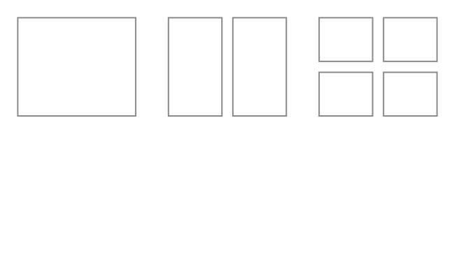

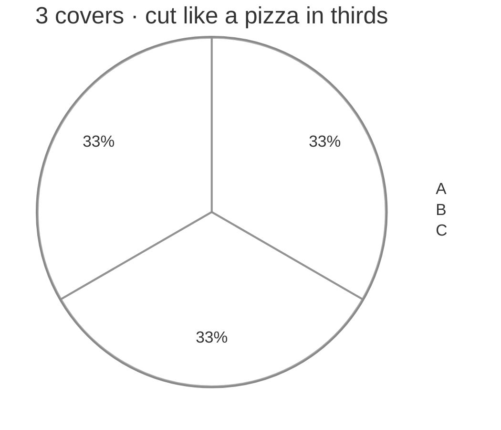
*Three covers are cut like a pizza into thirds, three wedges meeting at the centre of the cell with one edge running straight up (A, then B, then C clockwise from the top), not three vertical strips. Two covers split corner to corner; four make quadrants. Each poster is scaled to fill the whole cell and clipped to its piece. `block-beta` is a grid and can't draw diagonals, so the two-cover picture is an approximation of the real cell. Covers go in showtime order; five or more show the first four with a "+N" corner badge (an addition — the spec stops at four).*

**Viewing drawer** (opens from tapping a movie in the day panel)
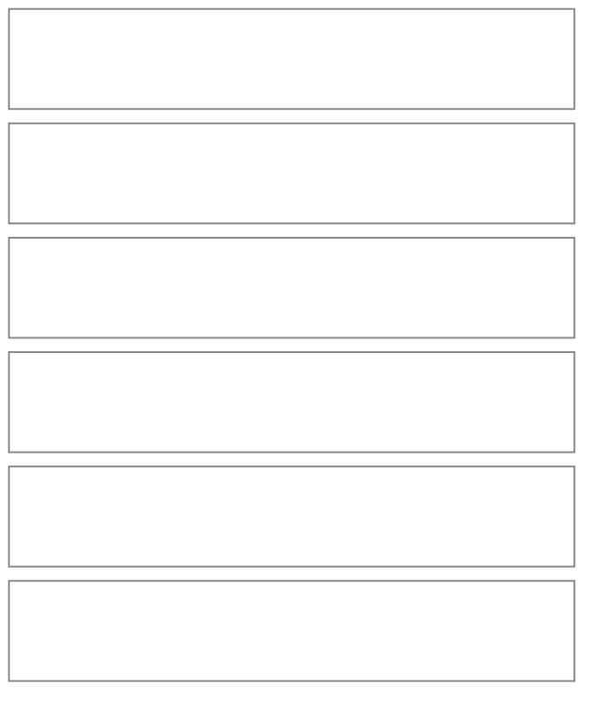
*The amounts are what a non-member would have paid; members pay no convenience fee, so the fee shown is one you skipped. Actions follow the state table above, so "Mark seen" is absent once seen. Mark paid and Edit swap this drawer's content in place (with "‹ Back to movie"), they don't open anything on top. Related actions sit in one tinted block; Remove stands apart and asks for a destructive confirm.*

**Add to calendar — pick** (drawer, step 1)
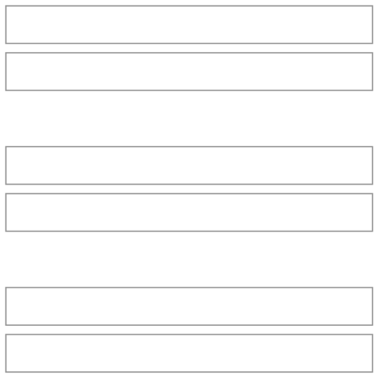
*An empty search shows your unseen watchlist; typing searches your watchlist and the movie database together, watchlist matches first. The same picker opens Add to watchlist. Search results show a title and year only; the release date, runtime and rating arrive once a movie is picked. The movie database allows a limited number of lookups a day, shared across everyone using the app, so typing waits for a pause and repeat searches are remembered. If search is unavailable, or a movie isn't in the database, "Add it by title" asks for a title and, optionally, a release date; that movie has no poster, so its cover is a title tile.*

**Add to calendar — details** (the same drawer, step 2; the content swaps in place)
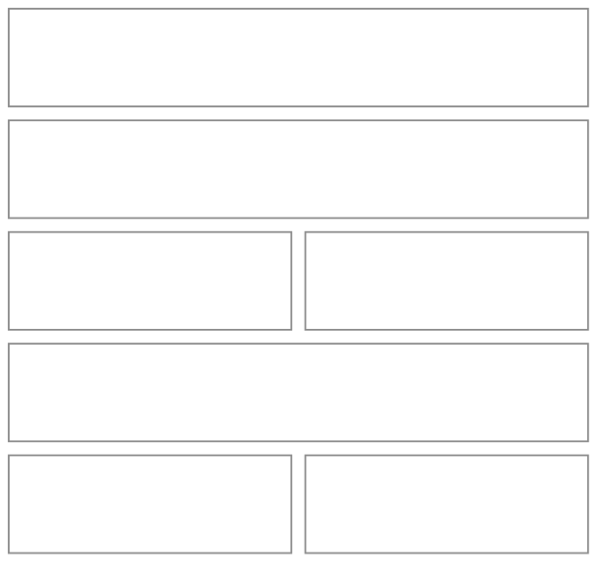
*A date in the past saves as Seen with no prompt; a future date saves as Planned. A movie not on your watchlist joins it automatically. "+ Add ticket details" reveals the Ticket fields in place, which suits backfilling and pre-bought tickets. Add past movies is this same drawer in a past-movies mode, shown next. From the watchlist drawer, "Add to calendar" skips the pick step because the movie is already chosen. The edit form is this same step, prefilled.*

**Add past movies — details** (the same drawer in past-movies mode, from Setup or the empty Calendar)
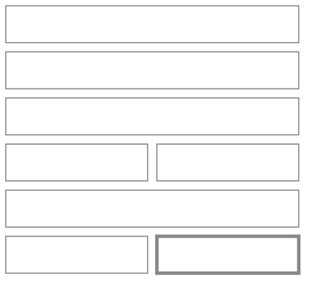
*Here the primary button is "Add + another": it saves, shows the "✓ added · N so far" strip (it appears after the first one), and drops back to the search with the form cleared, ready for the next movie. "Add & finish" saves and closes. Closing the drawer ends the loop and loses nothing, since each movie saves the moment it's added. The normal "+ Add" from the Calendar keeps a single Add button. A viewing can't be dated before your membership start date, so the date picker starts there.*

**Ticket** (swaps in place inside the viewing drawer; premium format shown, itemized)
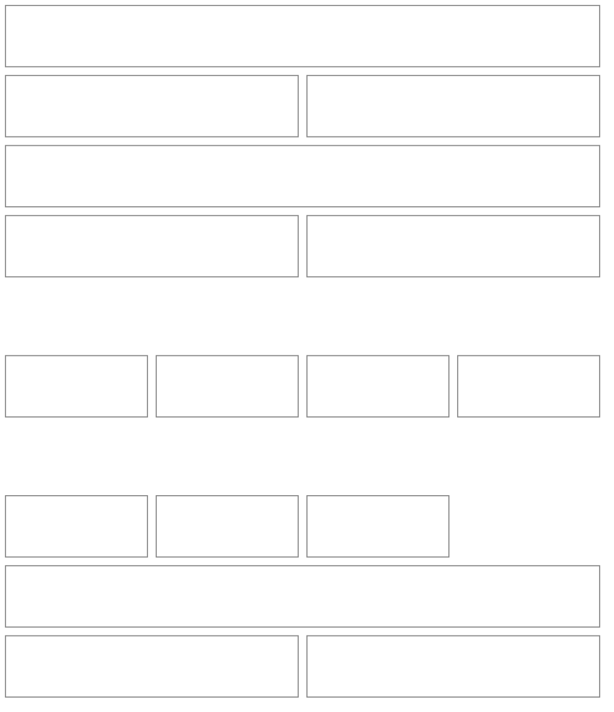
*Members pay no convenience fee — it's tracked so the app can count the fees your membership saves you. The fee is entered each time: chips are the fees you've entered before, plus $0, and "Other" opens a field (a fee estimate, a Stretch idea, would sit beside the chips). Tax works the same way: the chips are the rates you've used on past tickets plus the rate gauged from your membership bill, and the one you use most is preselected, so a rate you've moved to for movies replaces the membership's as the default; "Other" opens a rate field. Standard price appears only when the format isn't Standard — it's what makes premium savings countable. The format is always your pick from the fixed list; the app never tries to find out which formats a movie plays in. Editing a ticket adds a trash icon bottom-left of the footer.*

**Ticket — all-in total** (the same form after switching the toggle at the top)
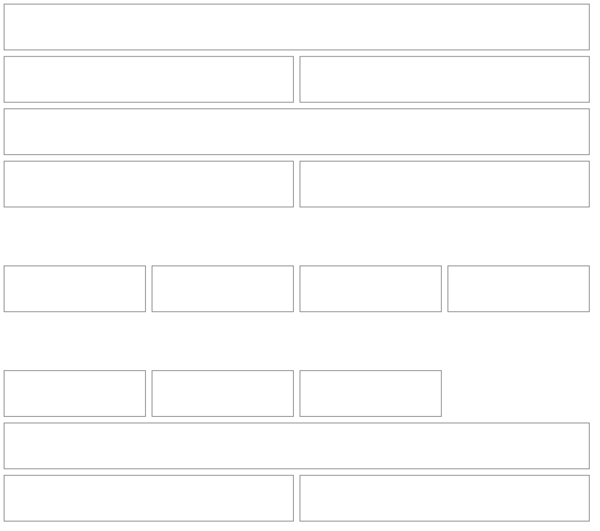
*For when all you have is the one number on a receipt or checkout screen. The total is saved exactly; the price and tax are estimated from it by taking off the fee and the chosen rate, and the split line shows what that came to. With no rate chosen the whole remainder counts as price and tax is zero. Total savings and fees avoided don't depend on the estimate; premium savings do, so a premium ticket is better entered itemized. Opening an all-in ticket to edit it reopens it in this mode.*

**Seen prompt** (a drawer that surfaces by itself)
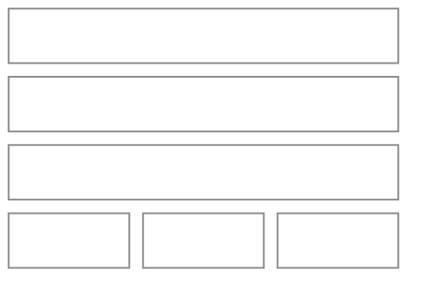
*Surfaces by itself the next time the app is open after a planned showtime ends; several pending prompts queue one at a time, and if another drawer is open it waits until that one closes. "Later" dismisses until the next open. "Didn't go" removes the planned viewing after a destructive confirm. "Seen it" marks the movie seen on your watchlist. "Later" and "Didn't go" are additions to the spec's single prompt.*

**Watchlist — Opening** (the default tab)
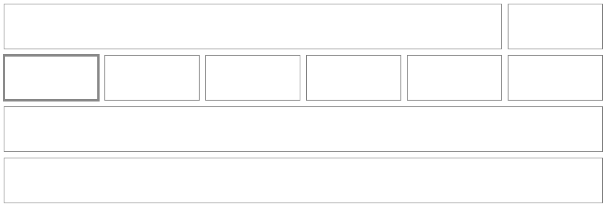
*Six tabs sit right under the header, in this order: Opening, All, Must See, Want to See, If I Have Time, Seen. Opening is the default and the watchlist's one emphasized surface: its label carries an accent and a count whenever something opens in the next seven days. It lists only unseen movies releasing between today and a week out, soonest first, with "in N days" on each row. With nothing opening it shows one muted line and a link to All. On a phone the strip scrolls sideways with the full names.*

**Watchlist — All**
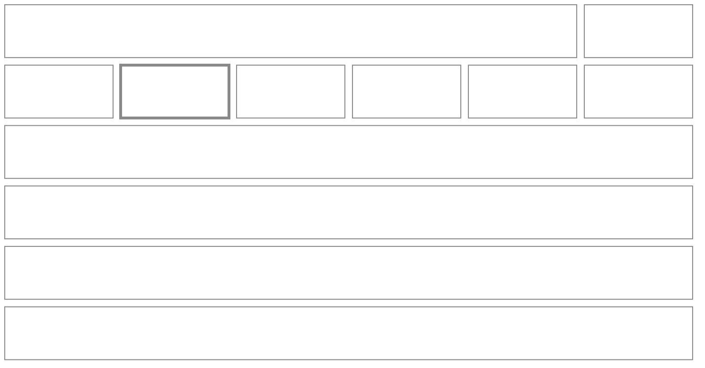
*The three priority tabs list only unseen movies of that priority; Seen lists the ones you have; All shows everything — unseen first, by priority and then release date, seen ones last. A movie opening this week also appears in All and in its priority tab. Each row shows release date, preferred format, a priority badge, a Seen check once watched, and the next planned date — or the latest watched date, with "×2" for rewatches. Tapping a row opens a drawer: Add to calendar (swaps in place), Edit (swaps in place), Remove.*

**Add to watchlist — details** (drawer, step 2; step 1 is the picker shown above)
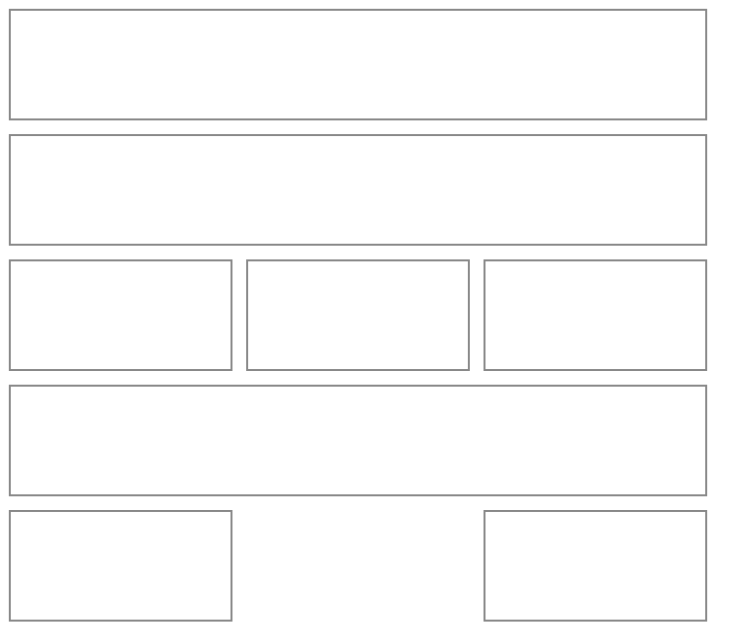
*Shows what the movie database knows (release date, runtime, rating). Priority defaults to Want to See; preferred format is optional and defaults to no preference. The app never tries to find out which AMC formats a movie plays in; the preferred format is always a plain pick from the fixed list (Standard and the five premium formats), or none.*

**Dashboard**
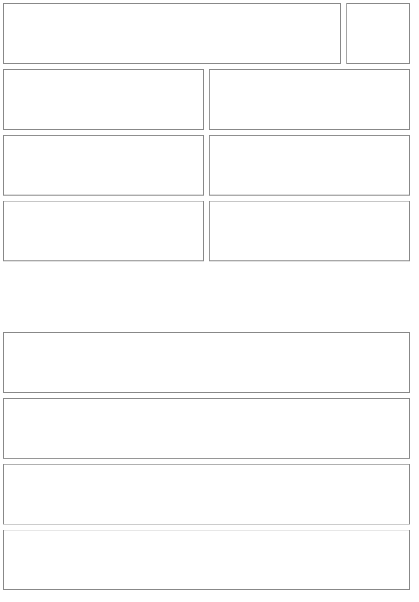
*Ticket savings count everything a non-member would have paid — price, the convenience fee you skipped, and tax — and the fees tile shows the fee part on its own. The money tiles are the MVP dashboard; the four chart sections below them arrive in Next Steps. Movies watched and movies this week stay on the Calendar's counters rather than repeating here. The gear opens Membership settings — the Setup fields again, as stacked `Disclosure` groups instead of steps.*

## Reusable Components

| Component | Used in | Purpose |
|---|---|---|
| PosterCover | cells, rows, drawers, picker | a poster with a tinted title-initials fallback; the repo's `EnrichedImage` hides itself on error, which would leave a hole in a full-bleed cell |
| PosterSplit | Calendar `renderCell` | fills the whole cell with one to four covers (full, corner-to-corner, pizza thirds, quadrants), "+N" past four; date number in a corner over a shade; ring for selected, accent for today |
| StatTile | Dashboard, Calendar counters | one number and a label; the only card allowed inside a screen |
| GoalChip | Calendar | weekly or monthly goal: met / not yet |
| MoviePicker | Add to calendar, Add to watchlist, Add past movies | one search over the watchlist and the movie database, watchlist first, with the rewatch note |
| AddDrawer | Calendar, Watchlist, Setup's past movies | the two-step pick-then-details `Drawer` for either destination; past-movies mode makes "Add + another" the primary action and keeps a running count |
| ViewingRow | day panel | poster thumb, title, time, format badge, stars, price, state |
| ViewingDrawer | day panel | `Drawer` at every width; grouped actions, Remove last in red; Mark paid and Edit swap in place |
| SeenPrompt | auto, after a showtime | `Drawer` with stars plus Seen it / Didn't go / Later; queues one at a time |
| FormatBadge, PriorityBadge | rows, drawers, Watchlist | pills built on Dreamer UI `Badge` |
| FeeChips, TaxChips | Ticket | past fees (and $0) or past tax rates (and the one gauged from your bill) as chips, each plus an "Other" field; the most-used rate is preselected |
| ManualMovieForm | MoviePicker | "Add it by title": a title and an optional release date, for when search is unavailable or a movie isn't found |
| StarRating | Seen prompt, edit viewing, rows (read-only) | one to five stars; custom, since Dreamer UI has none |
| OpeningTab | Watchlist | the first and default tab; carries an accent and a count when something opens in the next seven days; its empty state links to All |
| BottomNav | shell | Dashboard · Calendar · Watchlist with Calendar centred and prominent; new, because Waypoint's `TripBottomNav` is trip-specific |
| SetupStepper | Setup | a local step index, not a library component; `StepThroughModal` pages through dismissable items and doesn't fit |
| `SectionHeader`, `ModalFooterActions`, `DeleteIconButton` | every tab and form | the phone-shell basics. Today they live in Waypoint's folder; a second app using them means moving them to central `src/components` |
| Chart blocks | Dashboard (Next Steps) | built on `recharts` (already installed); Nine Lives' `TrendLineChart` is app-scoped and line-only, so bars and share charts are new |
| `FormSection` (central `src/ui`) | Membership settings | the shared `Disclosure` group shell |
| Empty state | each list, and the empty Calendar | an icon, one muted line, and the CTA in the header |

## User Journeys

**First launch: setup and past movies**
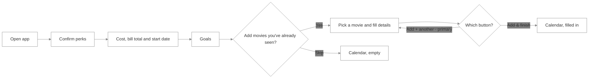

**Add to watchlist**
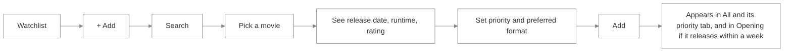

**Add to calendar**
```mermaid
%%{init: {'theme': 'base', 'themeVariables': {'primaryColor': 'transparent', 'clusterBkg': 'transparent', 'primaryBorderColor': '#888888', 'clusterBorder': '#888888', 'lineColor': '#888888', 'primaryTextColor': '#333333'}}}%%
flowchart LR
    A[Pick a day] --> B[+ Add opens the drawer] --> C[Search or choose from watchlist] --> D{Seen before?}
    D -->|Yes| E[Rewatch note] --> F[Date and showtime]
    D -->|No| F
    F --> G{Date in the past?}
    G -->|Yes| H[Saved as Seen]
    G -->|No| I[Saved as Planned]
    H --> J{On watchlist?}
    I --> J
    J -->|No| K[Added to watchlist]
    J -->|Yes| L[Poster fills that day's cell]
    K --> L
```

**Mark paid**
```mermaid
%%{init: {'theme': 'base', 'themeVariables': {'primaryColor': 'transparent', 'clusterBkg': 'transparent', 'primaryBorderColor': '#888888', 'clusterBorder': '#888888', 'lineColor': '#888888', 'primaryTextColor': '#333333'}}}%%
flowchart LR
    A[Tap a day] --> B[Tap the movie] --> C[Mark paid] --> D[Pick format] --> M{Itemized or all-in total?}
    M -->|Itemized| P[Ticket price] --> E{Premium format?}
    M -->|All-in total| T[Total with tax and fee] --> E
    E -->|Yes| F[Standard price for the showing] --> H
    E -->|No| H[Fee: tap a chip or enter one]
    H --> I[Tax rate: tap a chip or enter one] --> J[Save]
    J --> K[Back to the movie, savings and dashboard update]
```

**Mark seen**
```mermaid
%%{init: {'theme': 'base', 'themeVariables': {'primaryColor': 'transparent', 'clusterBkg': 'transparent', 'primaryBorderColor': '#888888', 'clusterBorder': '#888888', 'lineColor': '#888888', 'primaryTextColor': '#333333'}}}%%
flowchart LR
    A[Showtime ends] --> B[App opens: Seen prompt surfaces] --> C{Your answer}
    C -->|Seen it| D[Optional stars] --> E[Watchlist shows Seen, counters update]
    C -->|Didn't go| F[Confirm remove] --> G[Viewing removed, movie stays on watchlist]
    C -->|Later| H[Dismissed until next open]
```

**Edit or remove a viewing**
```mermaid
%%{init: {'theme': 'base', 'themeVariables': {'primaryColor': 'transparent', 'clusterBkg': 'transparent', 'primaryBorderColor': '#888888', 'clusterBorder': '#888888', 'lineColor': '#888888', 'primaryTextColor': '#333333'}}}%%
flowchart LR
    A[Tap a day] --> B[Day panel lists its movies] --> C[Tap a movie] --> D[Viewing drawer] --> E{Action}
    E -->|Edit| F[Same form, prefilled, in the drawer] --> G[Save] --> J
    E -->|Remove| H[Destructive confirm] --> I[Viewing removed] --> J[Calendar, watchlist and savings recompute]
```
*Removing a movie's only viewing leaves it on the watchlist as unseen.*

## Form Field Organization

*"Grouping: none" means one flat form — still Dreamer UI's `Form`, just without a `Disclosure` or steps wrapper.*

| Entity | Initial (create) | Later (edit only) | Later-set entry point | Grouping | "Other" option? |
|---|---|---|---|---|---|
| Membership | perks (confirm, read-only), monthly cost before tax, start date (required), total on your bill with tax (optional), weekly goal, monthly goal | — | later edits through the Dashboard gear (catch-all edit) | **Steps** (3), for first-run; Membership settings uses `Disclosure` groups | none |
| Watchlist item | movie (picked), priority (defaults to Want to See), preferred format (optional, defaults to no preference)¹ | — | later edits through the watchlist drawer (catch-all edit) | none | none: priority is closed; format is a closed list¹ |
| Viewing | movie (picked), date (defaults to the selected day), showtime | ticket details, star rating | ticket: contextual Mark paid inside the viewing drawer, and an inline reveal on the add form; rating: contextual Seen prompt | none | none |
| Ticket | entry mode (itemized or all-in total), format¹, ticket price before tax or the all-in total, standard price (only when format isn't Standard), convenience fee skipped², tax rate³ | — | edits through the viewing drawer's Edit ticket | none | none |
| Star rating | stars one to five (optional) | — | Seen prompt, or edit viewing | none | none |

¹ Formats: Standard, Dolby Cinema, IMAX, PRIME at AMC, RealD 3D, and Laser. A watchlist item's preferred format can be empty, meaning no preference. This is a closed list that only the developer extends; nothing for users to add.
² The fee chips are the distinct fees from your past tickets, most recent first, plus $0; "Other" opens a field.
³ The tax chips are the distinct rates from your past tickets plus the rate gauged from your membership bill, the most-used one preselected; "Other" opens a rate field.

**Flagged for the TDD** (none of these change the screens above, but each shapes the data):
- **Fee in the savings math** — settled: members pay no convenience fee, so the fee on a ticket is one skipped and counts toward ticket savings, with its own "fees avoided" total. Still open: whether a fee is taxed (assumed not).
- **Tax** — no source exists, so the rate is gauged from the membership bill (total ÷ cost − 1) and then follows ticket history; each ticket stores its own rate and tax amount so an edit sticks.
- **All-in total** — a ticket can be entered as one number; its price and tax are then estimates, so a ticket needs to remember which way it was entered.
- **Start date** — required at setup; fixes the billing day and the earliest viewing date.
- **Showtime end** — the Seen prompt fires at showtime plus runtime, so a viewing needs a showtime and the movie's runtime, with a fallback when runtime is missing.
- **Time values** — a viewing's date and showtime is an instant (keyed by local day on the calendar), not a date-only value; the Watchlist release date is date-only.
- **Watchlist "Seen"** — stored or derived from "any viewing is Seen" (derived keeps it from drifting when viewings are edited or removed).
- **Calendar cells** — prove that `customStyles` can clear padding and border and make cells taller than square before committing to the layout.
- **Tabs** — the Watchlist now has six (Opening, All, Must See, Want to See, If I Have Time, Seen), up from the five first asked for; confirm Dreamer UI's `Tabs` can scroll sideways on a phone.
- **Opening window** — today through seven days out, judged against the viewer's local today; a release date is date-only (UTC midnight), so it follows the repo's date-only rules, not a plain timestamp comparison.
- **Movie database** — OMDb, with a limited number of lookups a day shared by every member, so search is debounced and cached and a manual "add by title" path exists; search results carry no release date.
- **Formats** — settled: the app never looks up which formats a movie plays in; the member picks from the fixed list.
- **Perks copy** — the exact A-List perk wording for the confirm step needs to come from AMC's own page.
- **Membership cost over time** — not modelled yet: one monthly cost applies to the whole history. Supporting price changes is a planned future goal.
