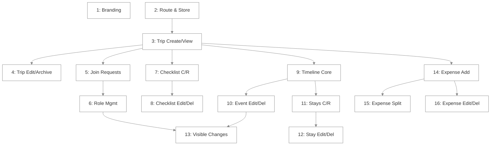
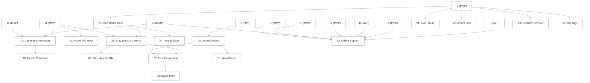
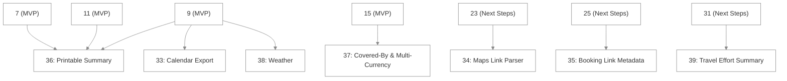

# Waypoint — Issue Roadmap

Tiers mirror the README's Core MVP / Next Steps / Stretch Goals. Within a tier, issues are ordered strictly by prerequisite. Per the skill's field-level No Isolated Setup rule: **every issue below only adds the fields, types, and rules clauses its own tier actually uses** — even where `TECHNICAL.md` already documents a field's eventual home in a later tier. Where a field is introduced by a later issue (e.g. `TransitDetails`, `sharedAlbumUrl`, `tags`), that's called out explicitly so nothing gets pre-added by mistake.

"Realtime Sync" and "Multi-Destination Itineraries" from the README's Core MVP list don't get their own issues: Realtime Sync is inherent to using Firestore listeners throughout (every issue below satisfies it by construction), and Multi-Destination is inherent to events already carrying their own `locationName`/`address` (Issue 9) plus Stays being their own entity (Issue 11) — there's no separate "Leg" concept to build per `TECHNICAL.md`'s Stay/Leg Segmentation.

**Every entity's Update/Delete follow-up is scheduled in the same tier as its Create+Read issue, sequenced right after it** — per Create+Read Pairing, deferring Update/Delete doesn't mean deferring it to a later *tier*. Each entity below gets exactly one Create+Read issue and one Edit/Delete issue.

**Prerequisites below list only the immediate dependency, not the full chain** — if Issue C depends on Issue B and Issue B already depends on Issue A, C's Prerequisites says just "Issue B." The three graphs below make the full chain visible at a glance: any two issues with no path between them (direct or through a shared ancestor) can be worked in parallel; anything connected by an arrow (however many hops) can't start until its upstream side lands.

## Dependency Graphs

**MVP Tier**

Issue 1 has no edges — it can run any time, in parallel with everything. Once Issue 3 lands, Issues 4/5/7/9/14 can all start in parallel.

**Next Steps Tier** (nodes marked MVP are prerequisites from the tier above, shown for context — not redrawn in full)

Issues 21, 22, 23, 29, and 30 all only need Issue 3 — they can proceed in parallel with each other and with most of the rest of this tier.

**Beyond Tier**

---

## MVP Tier

### Issue 1: App Registration, Branding & Manifest

**Prerequisites:** None

**Target PR Size:** ~200 lines

**Files:**
- `public/manifest-waypoint.json`
- `public/logos/by-app/logo-waypoint.svg`
- `public/banners/by-app/banner-waypoint.png`
- `cloudflare-worker.js`
- `src/lib/app/app.constants.ts`
- `src/lib/app/app.registry.ts`

### Description
Register Waypoint in the platform's app catalog with placeholder branding and social-preview metadata.

### Possible Approach
1. Add `manifest-waypoint.json` (name, colors, icons) and placeholder `logo-waypoint.svg`/`banner-waypoint.png`.
2. Add `WAYPOINT = 'waypoint'` to `app.constants.ts`.
3. Register Waypoint's metadata and `/apps/waypoint` route in `app.registry.ts`.
4. Update `cloudflare-worker.js` to inject OG tags for `/apps/waypoint` paths.

### Success Criteria
- [ ] Waypoint appears in the app switcher catalog.
- [ ] `/manifest-waypoint.json` loads successfully.
- [ ] Cloudflare worker injects correct OG meta tags for `/apps/waypoint`.

---

### Issue 2: Route, Placeholder Screen & Store Foundation Check

**Prerequisites:** None (parallel to Issue 1)

**Target PR Size:** ~250 lines (smaller if `src/store/` already exists)

**Files:**
- `src/routes/AppRoutes.tsx`
- `src/apps/waypoint/Waypoint.tsx`
- `src/store/index.ts`, `src/store/actions/globalActions.ts`, `src/store/listeners/createFirestoreCollectionListener.ts`, `src/store/utils/createOptimisticCollectionSlice.ts` (only if not already present from an earlier mini app — check before creating)

### Description
Wire up Waypoint's route to a placeholder screen so every subsequent issue has something real to render into, per the "route before any other UI work" rule. Verify the central Redux store foundation exists; build it only if it genuinely doesn't.

### Possible Approach
1. Check whether `src/store/` already exists (another mini app may have built it already, per `TECHNICAL.md`'s Client State Management note) — if so, skip straight to step 4.
2. If it doesn't exist: add `configureStore`/`RootState`/typed hooks, the central `user` slice, `resetAllState`, `createFirestoreCollectionListener`, and `createOptimisticCollectionSlice` to `src/store/`.
3. Wrap `App.tsx` in `<Provider store={store}>` if not already done.
4. Add `/apps/waypoint` to `AppRoutes.tsx`, rendering a minimal `Waypoint.tsx` placeholder (just a loading/coming-soon state — no auth gate or trip logic yet, that's Issue 3).

### Success Criteria
- [ ] `/apps/waypoint` is reachable and renders the placeholder without errors.
- [ ] Central store foundation exists and is used (confirmed either newly built here, or verified already present).
- [ ] No trip-specific types, fields, or logic were added in this issue — that starts in Issue 3.

---

### Issue 3: Trip Space — Create & View (My Trips)

**Prerequisites:** Issue 2

**Target PR Size:** ~400 lines

**Files:**
- `src/apps/waypoint/types.ts`
- `src/apps/waypoint/security.ts`
- `src/apps/waypoint/utils/roleGuards.ts`
- `src/apps/waypoint/store/slices/tripSlice.ts`
- `src/apps/waypoint/store/listeners/tripListeners.ts`
- `src/apps/waypoint/store/index.ts`, `src/apps/waypoint/store/selectors.ts`
- `src/apps/waypoint/components/CreateTripModal.tsx`
- `src/apps/waypoint/Waypoint.tsx`
- `firestore.rules`
- `scripts/seeds/waypoint.ts`

### Description
The first real vertical slice: define `TripSpace`/`TripMember`/`UserRole` (MVP fields only — no `destinationLabels`, `tags`, or `sharedAlbumUrl*`, all added by their own later issues), let a user create a trip with just a title and estimated dates, and see their trips listed. This is Create+Read for `TripSpace`.

### Possible Approach
1. Define `TripSpace` (`id`, `title`, `coverImageUrl`, `startDate`, `endDate`, `defaultCurrency`, `members`, `inviteCode`, `createdBy`, `createdAt`, `lastEditedAt`) and `TripMember` (`uid`, `role`, `joinedAt`) in `types.ts`, plus `UserRole`.
2. Write `firestore.rules` for `apps/waypoint/trips/{tripId}`: read/write gated on `request.auth.uid` being a key in `members`; creation sets `createdBy` to the caller and seeds `members` with that uid as `ADMIN`.
3. Build `tripSlice.ts` (holds the list of trips the user belongs to) and `tripListeners.ts` (a `where('members.' + uid + ...)`-style membership query — confirm the exact query shape against `TECHNICAL.md` before writing the index, since `members` is a map, not an array).
4. Build `CreateTripModal.tsx` (DreamerUI `Form`, no grouping needed — two fields) and wire it into `Waypoint.tsx`'s "My Trips" list view (cards showing title + date range only — no destination/tag badges yet).
5. Seed one sample trip in `scripts/seeds/waypoint.ts`.

### CRUD & Entry-Point Requirements
- [ ] Create: a trip is created with a title and estimated start/end dates; the creator becomes `ADMIN`.
- [ ] Read: the My Trips list renders every trip the user belongs to, reachable as soon as `/apps/waypoint` loads past the placeholder — not a component that exists but is never rendered anywhere.
- [ ] Update: not covered by this issue — see Issue 4.
- [ ] Delete: not covered by this issue — see Issue 4.

### Success Criteria
- [ ] `firestore.rules` updated and seed data added, per Security Rules Design Criteria #6.
- [ ] No fields beyond the MVP list above exist on `TripSpace` yet.

---

### Issue 4: Trip Edit & Archive

**Prerequisites:** Issue 3

**Target PR Size:** ~300 lines

**Files:**
- `src/apps/waypoint/types.ts`
- `src/apps/waypoint/components/EditTripModal.tsx`
- `src/apps/waypoint/Waypoint.tsx`
- `firestore.rules`

### Description
Editing a trip's title/dates/cover photo/currency after creation, and archiving one. This is also where "Changing Trip Dates" (`TECHNICAL.md` State Machine 4a) actually gets built — the batched shift of every existing event's/stay's timestamps when the trip's dates move.

### Possible Approach
1. Build `EditTripModal.tsx` (DreamerUI `Form`, same fields as create — `destinationLabels`/`tags` aren't in this form yet, those arrive with Issues 29/30).
2. Add `isArchived: boolean` (default `false`) to `TripSpace` — a soft delete, not a hard one; a genuine hard-delete (cascading through every subcollection) is deliberately out of scope here and would need its own dedicated design pass.
3. Implement the trip-dates-change batch: when `startDate`/`endDate` change, shift every existing event's `startAt`/`endAt` and every stay's `checkInAt`/`checkOutAt`/`plannedArrivalAt`/`plannedDepartureAt` by the same delta, in one atomic batch, per State Machine 4a.
4. Add Edit (Editor/Admin) and Archive (Admin-only) affordances to `Waypoint.tsx`'s trip header; add a "show archived" toggle to My Trips so archived trips aren't silently lost.
5. `firestore.rules`: general field updates open to `EDITOR`/`ADMIN`; `isArchived` write `ADMIN`-only.

### CRUD & Entry-Point Requirements
- [ ] Create: not applicable — this issue only modifies existing trips.
- [ ] Read: archived trips stay visible via an explicit toggle on My Trips, not silently hidden forever.
- [ ] Update: title/dates/cover photo/currency are all editable after creation, reachable from the trip header.
- [ ] Delete: implemented as archive (soft-delete) and reversible — a true hard-delete is explicitly out of scope, not silently assumed to be covered.

### Success Criteria
- [ ] Editing dates after events/stays already exist correctly shifts every affected timestamp by the same delta, preserving `dayIndex` — confirmed against State Machine 4a.
- [ ] Archiving is reversible (un-archive exists).
- [ ] `firestore.rules` updated.

---

### Issue 5: Join Request Flow

**Prerequisites:** Issue 3

**Target PR Size:** ~400 lines

**Files:**
- `src/apps/waypoint/types.ts`
- `src/apps/waypoint/store/slices/pendingRequestsSlice.ts`
- `src/apps/waypoint/store/actions/membershipActions.ts`
- `src/apps/waypoint/hooks/useMyPendingRequests.ts`
- `src/apps/waypoint/components/MyPendingTrips.tsx`
- `src/apps/waypoint/components/MembersSection.tsx`
- `src/apps/waypoint/components/PendingMembersPanel.tsx`
- `firestore.rules`

### Description
The full invite/pending-request flow per `TECHNICAL.md`'s flat-collection pattern: requesting to join, seeing your own pending requests, and an Admin approving/declining. Per Flow Completeness, all three sides ship together.

### Possible Approach
1. Add `TripJoinRequest` to `types.ts`; add the exact three-branch rules block from `TECHNICAL.md` for `apps/waypoint/pendingRequests/{requestId}` (composite ID `{uid}_{tripId}`).
2. Build `useMyPendingRequests.ts` (`where('uid', '==', myUid)`) — key its effect on a stable derived string, not array identity, and resolve `loading` to `false` immediately on zero results (Known Footguns).
3. Build `MyPendingTrips.tsx`, rendered by `Waypoint.tsx` in the My Trips view, with a follow-up fetch per result to resolve `tripId` to a trip title.
4. Build `MembersSection.tsx` (new tab, added to `Waypoint.tsx`'s trip shell for the first time in this issue) containing `PendingMembersPanel.tsx` (`where('tripId', '==', id)` query, visible to `ADMIN` only) with approve (role picker + atomic batch add-to-members/delete-request) and decline (delete request) actions in `membershipActions.ts`.
5. Wire "Request to Join" into the invite-link landing state.

### CRUD & Entry-Point Requirements
- [ ] Create: a user sends a join request by following an invite link, writing to their own `{uid}_{tripId}` doc.
- [ ] Read: both sides are covered — the requester sees their own pending requests (My Trips), and a trip Admin sees incoming requests for their own trip (Members tab) — both reachable, not just queryable.
- [ ] Update: not applicable — a request is never patched (`allow update: if false`), matching the skill's pending-requests pattern exactly.
- [ ] Delete: covered both ways — declining (Admin) and approving (which deletes the request as part of the atomic batch) both remove the doc. A requester-initiated cancel is not covered by this issue — needs its own follow-up if wanted.

### Success Criteria
- [ ] Sending a request, viewing it as the sender, viewing it as the trip's Admin, and resolving it (approve/decline) all ship in this one issue — Flow Completeness.
- [ ] Approval is a single atomic `writeBatch`, never two separate writes.
- [ ] A pending requester's read access is exactly their own request document (Security Rules Design Criteria #8) — verified against `trips/{tripId}`'s rule having no pending-related exception.
- [ ] `firestore.rules` updated; no manual index added for `pendingRequests` (a `collectionGroup` scope creeping back in would need one).

---

### Issue 6: Role Management

**Prerequisites:** Issue 5

**Target PR Size:** ~250 lines

**Files:**
- `src/apps/waypoint/components/MembersSection.tsx`
- `src/apps/waypoint/components/MemberRoleBadge.tsx`
- `src/apps/waypoint/store/actions/membershipActions.ts`
- `src/apps/waypoint/utils/roleGuards.ts`
- `firestore.rules`

### Description
Lets an Admin change another member's role (including promoting to Admin) or remove a member, from the roster already visible in `MembersSection`.

### Possible Approach
1. Add `changeRole`/`removeMember` to `membershipActions.ts`.
2. Add `canChangeRole`/`canRemoveMembers` to `roleGuards.ts` — both explicitly block a user from targeting their own uid, per State Machine 13.
3. Add role-change/remove affordances to `MembersSection.tsx`'s roster (inline per member, Admin-only), using `MemberRoleBadge.tsx`.
4. Update `firestore.rules` so role/removal writes on `trips/{tripId}.members` are Admin-only and reject a caller targeting their own uid.

### Success Criteria
- [ ] An Admin can promote another member to Admin, change any other role, or remove a member.
- [ ] No member, Admin included, can change their own role — enforced in both the rule and the UI guard.
- [ ] Removing a member revokes access immediately without touching their historical assignments (nothing to migrate, since those live on other entities' `assignedMemberIds`/`payerUid`, not on the member record).

---

### Issue 7: Before the Road Checklist

**Prerequisites:** Issue 3

**Target PR Size:** ~350 lines

**Files:**
- `src/apps/waypoint/types.ts`
- `src/apps/waypoint/store/slices/checklistSlice.ts`
- `src/apps/waypoint/components/ChecklistSection.tsx`
- `src/apps/waypoint/components/ChecklistItemFormModal.tsx`
- `src/ui/FormSection.tsx` (only if no earlier mini app has built this yet)
- `firestore.rules`

### Description
Create+Read for `ChecklistItem`, grouped by category via stacked `Disclosure`.

### Possible Approach
1. Add `ChecklistItem` (incl. `category: ChecklistCategory` with `'OTHER'`, `customCategoryLabel`, `assignedToUids`, `markedCompletedByUid`/`markedCompletedAt`) to `types.ts`.
2. Build `ChecklistItemFormModal.tsx` (DreamerUI `Form`, no Steps — title/category/assignees is a short flat list) with a text field for `customCategoryLabel` that only shows once `category` is `'OTHER'`.
3. Build `ChecklistSection.tsx` (new tab in `Waypoint.tsx`) using `FormSection.tsx` for the `Disclosure`-per-category grouping, plus the completion-progress bar.
4. `firestore.rules`: membership-based read; write open to `EDITOR`/`ADMIN`; `COMMENTER` may only toggle `isCompleted` on items assigned to them.

### CRUD & Entry-Point Requirements
- [ ] Create: a checklist item is added with title/category/assignees.
- [ ] Read: items render grouped by category (`Disclosure`), reachable via the Checklist tab.
- [ ] Update: toggling `isCompleted` is covered here, since it's core to the checklist's purpose — see Issue 8 for general field editing.
- [ ] Delete: not covered by this issue — see Issue 8.

### Success Criteria
- [ ] `firestore.rules` and seed data updated.
- [ ] The "assigned to me" filter and the multi-assignee (👤👤) display are both present, matching `UX.md`.

---

### Issue 8: Checklist Edit & Delete

**Prerequisites:** Issue 7

**Target PR Size:** ~250 lines

**Files:**
- `src/apps/waypoint/components/ChecklistItemFormModal.tsx`
- `src/apps/waypoint/components/ChecklistSection.tsx`
- `firestore.rules`

### Description
Editing an existing checklist item's fields, and removing one.

### Possible Approach
1. Extend `ChecklistItemFormModal.tsx` with an edit mode, pre-filled from the existing item.
2. Add edit/delete affordances per item in `ChecklistSection.tsx`, gated `EDITOR`/`ADMIN` (matching create).
3. Add a guarded delete confirmation, not a bare single-tap delete.
4. `firestore.rules`: update/delete open to `EDITOR`/`ADMIN` — confirm no change is actually needed if the collection's rule is already scoped that broadly.

### CRUD & Entry-Point Requirements
- [ ] Create/Read: not applicable — covered by Issue 7.
- [ ] Update: an item's title/category/assignees can be edited after creation, reachable per item.
- [ ] Delete: an item can be removed, with a guarded confirmation, reachable per item.

### Success Criteria
- [ ] Delete requires confirmation, not a single accidental tap.
- [ ] Progress bar and per-category counts recalculate correctly after an edit or delete.

---

### Issue 9: Day-by-Day Timeline Core

**Prerequisites:** Issue 3

**Target PR Size:** ~400 lines (candidate to split further if it runs long — see note)

**Files:**
- `src/apps/waypoint/types.ts`
- `src/apps/waypoint/store/slices/eventsSlice.ts`
- `src/apps/waypoint/components/TimelineSection.tsx`
- `src/apps/waypoint/components/EventCard.tsx`
- `src/apps/waypoint/components/EventFormModal.tsx`
- `src/apps/waypoint/components/MapNavigationButton.tsx`
- `src/apps/waypoint/utils/mapUrlHelpers.ts`
- `src/apps/waypoint/utils/dateUtils.ts`
- `firestore.rules`

### Description
Create+Read for `TimelineEvent`, MVP-scope fields only: `eventType`'s four-way split with each type's one quick field (`transitType` bare — no `transitDetails` sub-object yet, that's Issue 20), `mealType`, `settings`, or nothing for Free Time — plus day-tabbed grouping and 1-tap map navigation.

### Possible Approach
1. Add `TimelineEvent`, `EventType`, and minimal `EventDetails` variants to `types.ts` — `TravelEventDetails` here is just `{ transitType: TransitType }`, no `transitDetails`/`isAutoGenerated` yet.
2. Build `EventFormModal.tsx` as a two-step flow (local step-index state, no DreamerUI stepper): Step 1 (type/title/day/start time), Step 2 (the type's one quick field + location + assignees).
3. Build `mapUrlHelpers.ts` (platform-detected deep link, coordinates if available else a text query) and `MapNavigationButton.tsx`.
4. Build `TimelineSection.tsx`: day tabs including "All", `EventCard.tsx` per event, "+ Add Event" placed under the tabs (not after the list).
5. `firestore.rules`: membership read; `EDITOR`/`ADMIN` write for new events.

### CRUD & Entry-Point Requirements
- [ ] Create: an event is added via the two-step flow (type/title/day/time, then the type's quick field + location + assignees).
- [ ] Read: events render on the day-tabbed Timeline (incl. "All"), each with a working Navigate button — reachable directly, not a hidden component.
- [ ] Update: not covered by this issue — see Issue 10.
- [ ] Delete: not covered by this issue — see Issue 10.

### Success Criteria
- [ ] Navigate opens the correct native map app with coordinates when available, a text query otherwise — confirmed against the Navigate journey in `UX.md`.
- [ ] No `transitDetails`, `changeHistory`, `cuisines`, `menuLink`, or `isAutoGenerated` fields exist yet — those belong to Issues 13 and 20.
- [ ] `firestore.rules` and seed data updated.

---

### Issue 10: Timeline Event Edit & Delete

**Prerequisites:** Issue 9

**Target PR Size:** ~350 lines

**Files:**
- `src/apps/waypoint/components/EventFormModal.tsx`
- `src/apps/waypoint/components/EventCard.tsx`
- `src/apps/waypoint/components/TimelineSection.tsx`
- `firestore.rules`

### Description
Editing an existing event (same two-step flow, pre-filled) and removing one. This is a real prerequisite for Issue 13, not just a nice-to-have: Visible Itinerary Changes narrows *this* edit path once the trip has started, and has nothing to narrow until this issue exists.

### Possible Approach
1. Extend `EventFormModal.tsx` with an edit mode — same two-step flow, pre-filled from the existing event.
2. Add edit/delete affordances to `EventCard.tsx`, gated `EDITOR`/`ADMIN`.
3. Add a guarded delete confirmation.
4. `firestore.rules`: update/delete open to `EDITOR`/`ADMIN` for now — Issue 13 narrows this further (Admin-only once the trip has started), it doesn't replace it.

### CRUD & Entry-Point Requirements
- [ ] Create/Read: not applicable — covered by Issue 9.
- [ ] Update: an event's fields can be edited after creation, pre-filled into the same Steps flow used to create it.
- [ ] Delete: an event can be removed, with a guarded confirmation.

### Success Criteria
- [ ] Editing a multi-day event's span correctly updates `endDayIndex`.
- [ ] Delete requires confirmation.
- [ ] `firestore.rules` updated — documented as the rule Issue 13 will narrow, not replace.

---

### Issue 11: Stays

**Prerequisites:** Issue 9

**Target PR Size:** ~400 lines

**Files:**
- `src/apps/waypoint/types.ts`
- `src/apps/waypoint/store/slices/staysSlice.ts`
- `src/apps/waypoint/components/StaysSection.tsx`
- `src/apps/waypoint/components/StayCard.tsx`
- `src/apps/waypoint/components/StayFormModal.tsx`
- `src/apps/waypoint/components/TimelineSection.tsx` (adding the stay-banner strip)
- `src/apps/waypoint/store/selectors.ts` (Stay/Leg Segmentation derivation)
- `firestore.rules`

### Description
Create+Read for `Stay`. This is what actually satisfies the README's Multi-Destination Itineraries line, alongside Issue 9 — there's no separate "Leg" entity per `TECHNICAL.md`.

### Possible Approach
1. Add `Stay` to `types.ts` (`checkInAt`/`checkOutAt`/`checkInTimezone`, `plannedArrivalAt`/`plannedDepartureAt` defaulting from the official times at creation).
2. Build `StayFormModal.tsx` (flat form, no grouping) and `StaysSection.tsx` (new tab) with `StayCard.tsx`.
3. Add a `selectActiveStaysForDay(dayIndex)` selector implementing Stay/Leg Segmentation (matching `plannedArrivalAt`/`plannedDepartureAt` against the day, returning every match — a transition day can have more than one).
4. Render the resulting Stay banner(s) at the top of `TimelineSection.tsx` for the currently viewed day, stacking when there's more than one.
5. `firestore.rules`: same membership/`EDITOR`+`ADMIN` pattern as events.

### CRUD & Entry-Point Requirements
- [ ] Create: a stay is added with name/address/official check-in-out and planned arrival/departure.
- [ ] Read: stays render on the Stays tab, and the derived banner(s) render at the top of Timeline for the matching day(s) — reachable, not just computable.
- [ ] Update: not covered by this issue — see Issue 12.
- [ ] Delete: not covered by this issue — see Issue 12.

### Success Criteria
- [ ] A transition day (two overlapping Stays) renders both banners, not just one — verified against `TECHNICAL.md`'s explicit "not just one" note.
- [ ] `firestore.rules` and seed data updated.

---

### Issue 12: Stay Edit & Delete

**Prerequisites:** Issue 11

**Target PR Size:** ~300 lines

**Files:**
- `src/apps/waypoint/components/StayFormModal.tsx`
- `src/apps/waypoint/components/StayCard.tsx`
- `src/apps/waypoint/components/TimelineSection.tsx`
- `firestore.rules`

### Description
Editing an existing stay and removing one.

### Possible Approach
1. Extend `StayFormModal.tsx` with an edit mode, pre-filled.
2. Add edit/delete affordances to `StayCard.tsx`, gated `EDITOR`/`ADMIN`, with a guarded delete confirmation.
3. Verify `TimelineSection.tsx`'s stay banner correctly stops showing a deleted stay and reflects an edited one immediately.

### CRUD & Entry-Point Requirements
- [ ] Create/Read: not applicable — covered by Issue 11.
- [ ] Update: a stay's details (including planned vs. official times) can be edited after creation.
- [ ] Delete: a stay can be removed, with a guarded confirmation.

### Success Criteria
- [ ] Editing or deleting a stay is reflected on Timeline's banner without a page refresh.

---

### Issue 13: Visible Itinerary Changes

**Prerequisites:** Issue 6, Issue 10

**Target PR Size:** ~300 lines

**Files:**
- `src/apps/waypoint/types.ts`
- `src/apps/waypoint/components/EventCard.tsx`
- `src/apps/waypoint/components/ChangeBadge.tsx`
- `src/apps/waypoint/utils/roleGuards.ts`
- `firestore.rules`

### Description
Adds `changeHistory` to `TimelineEvent` and narrows Issue 10's edit path to Admin-only once the trip has started.

### Possible Approach
1. Add `EventFieldChange` (with its own `changedBy`/`changedAt`) and `EventChangeSnapshot` (`changes[]` plus denormalized `latestChangedBy`/`latestChangedAt`) to `types.ts`, and `changeHistory: EventChangeSnapshot[]` to `TimelineEvent`.
2. In Issue 10's event-update path, diff against the previous doc, build one `EventChangeSnapshot` covering every changed field, and append (never overwrite) — gated to only run once `now >= trip.startDate`.
3. Build `ChangeBadge.tsx` (latest entry shown, expandable to the full array) and render it on `EventCard.tsx`.
4. `firestore.rules`: narrow Issue 10's update/delete rule so it's `ADMIN`-only once `now >= trip.startDate`; creating new events (Issue 9) stays open to `EDITOR`s throughout.

### Success Criteria
- [ ] `changeHistory` accumulates only post-trip-start, and only ever appends.
- [ ] Editing an existing event post-start is rejected by `firestore.rules` for a non-Admin `EDITOR`.
- [ ] `ChangeBadge` reachable directly on each event card — no extra navigation needed.

---

### Issue 14: Expense Add & Totals

**Prerequisites:** Issue 3

**Target PR Size:** ~350 lines

**Files:**
- `src/apps/waypoint/types.ts`
- `src/apps/waypoint/store/slices/expensesSlice.ts`
- `src/apps/waypoint/components/ExpensesSection.tsx`
- `src/apps/waypoint/components/ExpenseFormModal.tsx`
- `src/apps/waypoint/store/selectors.ts` (totals rollup)
- `firestore.rules`

### Description
Create+Read for `TripExpense`, Add-only: title, amount-or-range, payer, day (or "Other"). Saved with `targetType: 'EVERYONE_CURRENT'` and a snapshot of current members by default — Split (Issue 15) is what lets that be reconsidered.

### Possible Approach
1. Add `TripExpense` to `types.ts` with the full field list from `TECHNICAL.md` (Add-relevant fields are populated by this issue; `splitAmounts` stays `null` until Issue 15 touches it, `targetType` defaults to `'EVERYONE_CURRENT'`).
2. Build `ExpenseFormModal.tsx`: title, amount (with a toggle to a min/max range instead), currency (defaulted from... note `defaultCurrency` may be `null` this early — fall back to a hardcoded default like `"USD"` if so, since Trip Space's currency-setting isn't built until Issue 4), payer, day.
3. Build `ExpensesSection.tsx` (new tab): day tabs incl. "All"/"Other", and a Totals block (Paid so far / Expected / combined Total, each a sum filtered by `status`, ranges summed as min/max).
4. `firestore.rules`: membership read; `EDITOR`/`ADMIN` write, `VIEWER` limited to their own `paidMemberStatus` toggle.

### CRUD & Entry-Point Requirements
- [ ] Create: an expense is added with title/amount-or-range/payer/day, defaulting to `EVERYONE_CURRENT` and an even split snapshot.
- [ ] Read: expenses render grouped by day (incl. "All"/"Other"), with the three Totals figures — reachable via the Expenses tab.
- [ ] Update: not covered by this issue — see Issue 16 for general editing; Issue 15's Split is a distinct, narrower update (target/split only).
- [ ] Delete: not covered by this issue — see Issue 16.

### Success Criteria
- [ ] An `EXPECTED` range expense correctly contributes to Expected/Total as a range, not a single number.
- [ ] No `targetType` other than `'EVERYONE_CURRENT'` is reachable from the UI yet — Split is a distinct, later issue.
- [ ] `firestore.rules` and seed data updated.

---

### Issue 15: Expense Split & Dues Summary

**Prerequisites:** Issue 14

**Target PR Size:** ~350 lines

**Files:**
- `src/apps/waypoint/components/ExpenseSplitModal.tsx`
- `src/apps/waypoint/components/ExpensesSection.tsx`
- `src/apps/waypoint/utils/splitCalculators.ts`
- `src/apps/waypoint/store/selectors.ts` (dues calculation)

### Description
The distinct Split action (per-expense target reconsideration) and the "who owes who" Dues Summary this makes possible — this is what satisfies the README's "assigned to everyone, specific members, or individuals" line.

### Possible Approach
1. Build `ExpenseSplitModal.tsx`: the four `ExpenseTargetType` options, member picker for `SPECIFIC_MEMBERS`, an auto-suggested even split shown immediately, adjustable per person into `splitAmounts` or resettable to `null`.
2. Build `splitCalculators.ts`: even-split math, and net-balance/debt-simplification for the Dues Summary — only over `status: 'PAID'` expenses with a resolved `amount` (never a range, never `EXPECTED`), and computing `EVERYONE_INCLUDING_FUTURE` live off current `trip.members` rather than a stored snapshot.
3. Add the Dues Summary block to `ExpensesSection.tsx`, above the expense list.
4. Wire "Split" onto each expense card, alongside the Add button already in `ExpensesSection.tsx`.

### CRUD & Entry-Point Requirements
- [ ] Create: not applicable — this issue only modifies existing expenses.
- [ ] Read: the Dues Summary is visible on the Expenses tab, above the expense list, reachable without opening an individual expense.
- [ ] Update: an expense's target type and per-person split amounts can be reconsidered via the Split action, reachable per expense card.
- [ ] Delete: not applicable to this issue.

### Success Criteria
- [ ] All four target types are selectable and produce a correct even split by default.
- [ ] Dues Summary excludes `EXPECTED`/range expenses from its calculation, and computes `EVERYONE_INCLUDING_FUTURE` live, not from a snapshot — both confirmed against State Machine 5.

---

### Issue 16: Expense Edit & Delete

**Prerequisites:** Issue 14

**Target PR Size:** ~300 lines

**Files:**
- `src/apps/waypoint/components/ExpenseFormModal.tsx`
- `src/apps/waypoint/components/ExpensesSection.tsx`
- `firestore.rules`

### Description
Editing an expense's title/amount/payer/day after creation, and removing one — deliberately not touching `targetType`/`splitAmounts`, which stay Issue 15's Split action.

### Possible Approach
1. Extend `ExpenseFormModal.tsx` with an edit mode, pre-filled, same fields as Add only.
2. Add edit/delete affordances per expense card, gated `EDITOR`/`ADMIN`, with a guarded delete confirmation.
3. Verify Totals and Dues Summary recalculate correctly after an edit or delete.

### CRUD & Entry-Point Requirements
- [ ] Create/Read: not applicable — covered by Issue 14.
- [ ] Update: title/amount/payer/day are editable after creation — target/split configuration stays exclusively Issue 15's Split action, not duplicated here.
- [ ] Delete: an expense can be removed, with a guarded confirmation.

### Success Criteria
- [ ] Totals and Dues Summary (if Issue 15 has landed) both recalculate correctly after an edit or delete.
- [ ] Delete requires confirmation.

---

## Next Steps Tier

### Issue 17: Comment & Proposal Workflow

**Prerequisites:** Issue 11, Issue 13, Issue 14

**Target PR Size:** ~400 lines

**Files:**
- `src/apps/waypoint/types.ts`
- `src/apps/waypoint/store/slices/commentsSlice.ts`
- `src/apps/waypoint/store/actions/proposalActions.ts`
- `src/apps/waypoint/components/ProposalReviewModal.tsx`
- `src/apps/waypoint/components/EventCard.tsx` (comment/proposal entry point)
- `firestore.rules`

### Description
Create+Read for `TripComment`, plus the proposal approve/decline action.

### Possible Approach
1. Add `TripComment`/`CommentTargetType`/`ProposalStatus` to `types.ts`.
2. Build a comment box on `EventCard.tsx` (Read: existing comments; Create: post one, or flag it as a proposal with a suggested field/value).
3. Build `ProposalReviewModal.tsx` and `proposalActions.ts` (atomic: apply the suggested change + set `APPROVED`, or just set `DECLINED`).
4. `firestore.rules`: posting covered by general membership; approving is `ADMIN`/`EDITOR`, but `ADMIN`-only once the trip has started for event-targeted proposals (reuses Issue 13's guard).

### CRUD & Entry-Point Requirements
- [ ] Create: a comment or proposal is posted, targeting an event/stay/expense/trip.
- [ ] Read: comments render wherever their target is shown — starting with `EventCard.tsx` in this issue, reachable directly on the card.
- [ ] Update: not applicable to a plain comment; a proposal's resolution (approve/decline) is itself the update this issue covers, via `proposalActions.ts`.
- [ ] Delete: not covered by this issue — see Issue 18.

### Success Criteria
- [ ] Approving an event-targeted proposal post-trip-start is rejected for a non-Admin Editor.
- [ ] `firestore.rules` updated.

---

### Issue 18: Delete Comment

**Prerequisites:** Issue 17

**Target PR Size:** ~200 lines

**Files:**
- `src/apps/waypoint/components/EventCard.tsx`
- `firestore.rules`

### Description
Removing a posted comment.

### Possible Approach
1. Add a delete affordance to each comment, visible to its author or an `ADMIN`, with a guarded confirmation.
2. `firestore.rules`: delete allowed for the comment's own `authorUid` or an `ADMIN`.

### CRUD & Entry-Point Requirements
- [ ] Create/Read/Update: not applicable — covered by Issue 17.
- [ ] Delete: a comment can be removed by its author or an Admin, with a guarded confirmation.

### Success Criteria
- [ ] `firestore.rules` updated; a non-author, non-Admin member cannot delete another member's comment.

---

### Issue 19: Active Trip HUD

**Prerequisites:** Issue 11

**Target PR Size:** ~300 lines

**Files:**
- `src/apps/waypoint/components/OverviewSection.tsx`
- `src/apps/waypoint/store/selectors.ts` (Active Now / Up Next derivation)

### Description
The Overview tab's live-mode state: Active Now / Up Next, derived from `startAt`/`endAt` against the current time.

### Possible Approach
1. Add `selectActiveEvent`/`selectUpNextEvent` selectors, using the Event Active Status Machine (`UPCOMING`/`ACTIVE`/`COMPLETED`).
2. Build the live-mode branch of `OverviewSection.tsx` (pre-trip branch, if not already stubbed, stays a simple placeholder until Issue 23).
3. Add `MapNavigationButton` to both HUD cards.

### Success Criteria
- [ ] Overview automatically shows the live HUD once `now >= trip.startDate`, and the pre-trip view otherwise.
- [ ] Active Now / Up Next update without a refresh as time passes.

---

### Issue 20: Transit Detail Cards

**Prerequisites:** Issue 9

**Target PR Size:** ~400 lines

**Files:**
- `src/apps/waypoint/types.ts`
- `src/apps/waypoint/components/TransitDetailsFields.tsx`
- `src/apps/waypoint/components/EventFormModal.tsx`
- `src/apps/waypoint/components/EventCard.tsx`

### Description
Adds the full `TransitDetails` union (per-type fields, `estimatedTravelTimeMs`) and `cuisines`/`menuLink` for Dining — the richer detail layer Issue 9 deliberately left out.

### Possible Approach
1. Add `TransitDetailsBase`, `PointToPointTransitDetails`, and all eight per-type variants to `types.ts`; add `transitDetails: TransitDetails | null` to `TravelEventDetails`; add `cuisines`/`menuLink` to `DiningEventDetails`.
2. Build `TransitDetailsFields.tsx` — a sub-form keyed by `transitType`, rendered inside `EventFormModal.tsx`'s Step 2 for Travel events, plus custom fields for `OTHER`.
3. Surface flight number / confirmation code / estimated travel time on `EventCard.tsx` for Travel events.

### Success Criteria
- [ ] Every `TransitType` has its correct predefined fields, matching `TECHNICAL.md`'s union exactly.
- [ ] `firestore.rules` needs no change (type/shape-only fields, per Security Rules Design Criteria #4) — confirmed, not just assumed.

---

### Issue 21: Live Travel Status

**Prerequisites:** Issue 3

**Target PR Size:** ~250 lines

**Files:**
- `src/apps/waypoint/hooks/useTravelStatus.ts`
- `src/apps/waypoint/components/TravelStatusPicker.tsx`
- `src/apps/waypoint/components/OverviewSection.tsx`
- `database.rules.json`

### Description
RTDB-backed, ephemeral status updates — deliberately outside Firestore/Redux.

### Possible Approach
1. Build `useTravelStatus.ts` (read/write `/waypointStatus/{tripId}/{uid}`), capped at 50 characters for `status`, optional `note`.
2. Build `TravelStatusPicker.tsx` as a popover/inline control, not a modal — the one named exception to the forms-in-modal default, per `UX.md`.
3. Add the collapsed status feed to `OverviewSection.tsx`'s live-mode HUD (Issue 19).
4. Add `database.rules.json` entries: writable only by the uid it belongs to, readable by any trip member, length-validated.

### Success Criteria
- [ ] Posting a status is a single lightweight interaction, not a full modal flow.
- [ ] `database.rules.json` enforces the 50-character cap and the self-only write rule.

---

### Issue 22: Shared Trip Album Link

**Prerequisites:** Issue 3

**Target PR Size:** ~250 lines

**Files:**
- `src/apps/waypoint/types.ts`
- `src/apps/waypoint/components/SharedAlbumLinkCard.tsx`
- `src/apps/waypoint/components/OverviewSection.tsx`
- `src/apps/waypoint/store/selectors.ts` (reminder visibility)
- `firestore.rules`

### Description
Adds `sharedAlbumUrl`/`sharedAlbumSetByUid`/`sharedAlbumSetAt` to `TripSpace`, plus the end-of-day/end-of-trip reminder banner.

### Possible Approach
1. Add the three fields to `TripSpace` in `types.ts`.
2. Build `SharedAlbumLinkCard.tsx` (set if unset by any member; change requires `EDITOR`/`ADMIN`) and place it on `OverviewSection.tsx`.
3. Add a `selectShouldShowAlbumReminder` selector (plain time-based check, no notification infra) and render the banner it drives.
4. `firestore.rules`: the any-member-if-unset / Editor-or-Admin-if-set write rule for these three fields specifically.

### Success Criteria
- [ ] Setting the link for the first time works for any member; changing an existing one is rejected for a `COMMENTER`/`VIEWER`.
- [ ] The reminder is a plain selector — no device tokens, no Cloud Function, confirmed against State Machine 8.

---

### Issue 23: Idea Board Core (Restaurant & Activity)

**Prerequisites:** Issue 3

**Target PR Size:** ~400 lines

**Files:**
- `src/apps/waypoint/types.ts`
- `src/apps/waypoint/store/slices/ideasSlice.ts`
- `src/apps/waypoint/components/IdeasSection.tsx`
- `src/apps/waypoint/components/IdeaCard.tsx`
- `src/apps/waypoint/components/IdeaFormModal.tsx`
- `src/apps/waypoint/components/OverviewSection.tsx` (pre-trip Ideas link, and prominence toggle)
- `firestore.rules`

### Description
Create+Read for `TripIdea`, Restaurant and Activity types only (Stay ideas are Issue 25) — posting, voting, and the pre-trip-prominent / post-start-discoverable display split.

### Possible Approach
1. Add `TripIdea`, `IdeaType`, `IdeaDetailsBase`, `SingleOccasionIdeaDetails` (`suggestedDays`, `suggestedTimeBlocks`), `RestaurantIdeaDetails`, `ActivityIdeaDetails` to `types.ts`.
2. Build `IdeaFormModal.tsx` (fields branch by `ideaType`) and `IdeaCard.tsx` (vote count/button, link, Restaurant/Activity-specific chips).
3. Build `IdeasSection.tsx` (new tab): type filter (Restaurant/Activity for now), voting wired to `voterUids` (a member can only toggle their own uid).
4. Fill in `OverviewSection.tsx`'s pre-trip Ideas entry as a real link into `IdeasSection`, and add the `now < trip.startDate` prominence derivation (Idea Board Prominence, State Machine 10).
5. `firestore.rules`: create/read open to any member; voting narrow (own uid only).

### CRUD & Entry-Point Requirements
- [ ] Create: a Restaurant or Activity idea is posted with its type-specific fields.
- [ ] Read: ideas render on the Ideas tab (type-filtered), reachable from Overview's pre-trip link.
- [ ] Update: voting (`voterUids`) is covered here since it's core to the board's purpose — see Issue 24 for general field editing.
- [ ] Delete: not covered by this issue — see Issue 24.

### Success Criteria
- [ ] Overview's pre-trip Ideas entry is a link, not a duplicated list, per `UX.md`.
- [ ] `firestore.rules` updated; the voting rule specifically rejects a member modifying another uid's presence in `voterUids`.

---

### Issue 24: Idea Edit & Delete (Restaurant & Activity)

**Prerequisites:** Issue 23

**Target PR Size:** ~250 lines

**Files:**
- `src/apps/waypoint/components/IdeaFormModal.tsx`
- `src/apps/waypoint/components/IdeaCard.tsx`
- `firestore.rules`

### Description
Editing a Restaurant/Activity idea's fields after posting, and removing one.

### Possible Approach
1. Extend `IdeaFormModal.tsx` with an edit mode, pre-filled.
2. Add edit/delete affordances to `IdeaCard.tsx`, gated to the idea's own `addedByUid` or `EDITOR`/`ADMIN`, with a guarded delete confirmation.

### CRUD & Entry-Point Requirements
- [ ] Create/Read: not applicable — covered by Issue 23.
- [ ] Update: an idea's fields are editable after posting by its author or an Editor/Admin — votes stay untouched by this action.
- [ ] Delete: an idea can be removed, with a guarded confirmation.

### Success Criteria
- [ ] Deleting an already-converted idea (`convertedToEntityId` set) is either blocked or clearly warns that the converted event/stay isn't affected — the two aren't re-linked.

---

### Issue 25: Stay Ideas & Stay Criteria

**Prerequisites:** Issue 23, Issue 11

**Target PR Size:** ~400 lines

**Files:**
- `src/apps/waypoint/types.ts`
- `src/apps/waypoint/store/slices/stayCriteriaSlice.ts`
- `src/apps/waypoint/components/StayCriteriaPanel.tsx`
- `src/apps/waypoint/components/IdeaCard.tsx`
- `src/apps/waypoint/components/IdeaFormModal.tsx`
- `src/apps/waypoint/store/selectors.ts` (grouping by location)
- `firestore.rules`

### Description
Adds the Stay `IdeaType`, `StayIdeaDetails`, and the shared `StayCriterion` list.

### Possible Approach
1. Add `StayIdeaDetails` (`location`, `matchedCriteriaIds`, `perks`) and `StayCriterion`/`StayCriterionTier` to `types.ts`.
2. Build `StayCriteriaPanel.tsx` (Editor/Admin-managed must-have/nice-to-have list).
3. Extend `IdeaFormModal.tsx`/`IdeaCard.tsx` for the Stay type: location tag, criteria multi-select from the shared list, free-form perks.
4. Add the `groupBy(ideaDetails.location)` selector for the Stay filter view in `IdeasSection.tsx`.
5. `firestore.rules`: `stayCriteria` read open to members, write `EDITOR`/`ADMIN`.

### CRUD & Entry-Point Requirements
- [ ] Create: a Stay idea is posted (location/criteria/perks), and a `StayCriterion` can be added to the shared list.
- [ ] Read: Stay ideas render grouped by location within the Stay filter; criteria render on `StayCriteriaPanel.tsx`.
- [ ] Update: not covered by this issue — see Issue 26.
- [ ] Delete: not covered by this issue — see Issue 26.

### Success Criteria
- [ ] Stay ideas group by location within the Stay filter.
- [ ] Criteria list is shared across the whole trip, not per-idea.
- [ ] `firestore.rules` and seed data updated.

---

### Issue 26: Stay Idea & Criterion Edit & Delete

**Prerequisites:** Issue 25

**Target PR Size:** ~300 lines

**Files:**
- `src/apps/waypoint/components/IdeaFormModal.tsx`
- `src/apps/waypoint/components/IdeaCard.tsx`
- `src/apps/waypoint/components/StayCriteriaPanel.tsx`
- `firestore.rules`

### Description
Editing/removing a Stay idea, and editing/removing a shared `StayCriterion`.

### Possible Approach
1. Extend the Stay branch of `IdeaFormModal.tsx`/`IdeaCard.tsx` with edit/delete, same permission pattern as Issue 24.
2. Add edit/delete to `StayCriteriaPanel.tsx`, gated `EDITOR`/`ADMIN`.
3. Removing a `StayCriterion` that's still referenced in some idea's `matchedCriteriaIds` — decide and implement: either strip the dangling reference on delete, or block deletion while referenced. Document whichever is chosen.

### CRUD & Entry-Point Requirements
- [ ] Create/Read: not applicable — covered by Issue 25.
- [ ] Update: both a Stay idea's fields and a criterion's label/tier are editable.
- [ ] Delete: both are removable, with guarded confirmation.

### Success Criteria
- [ ] Deleting a referenced `StayCriterion` behaves per whichever policy (strip vs. block) was chosen, not left undefined.

---

### Issue 27: Idea → Itinerary Conversion (Single)

**Prerequisites:** Issue 25, Issue 20

**Target PR Size:** ~350 lines

**Files:**
- `src/apps/waypoint/store/actions/ideaActions.ts`
- `src/apps/waypoint/components/IdeaCard.tsx`
- `src/apps/waypoint/components/EventFormModal.tsx` / `StayFormModal.tsx` (pre-fill support)

### Description
"Add to Itinerary" / "Select as Stay" — one atomic batch converting a single idea into a real `TimelineEvent` or `Stay`, pre-filling every known field.

### Possible Approach
1. Build `convertIdeaToEvent`/`convertIdeaToStay` in `ideaActions.ts`: create the target doc pre-filled from the idea's fields, set `convertedToEntityId` on the idea, both in one batch.
2. Add pre-fill support to `EventFormModal`/`StayFormModal` so they can open already populated, needing only day/time or check-in/out.
3. Wire the conversion buttons onto `IdeaCard.tsx`, following the same permission as creating that target type directly (`EDITOR`/`ADMIN`).

### Success Criteria
- [ ] Conversion is one atomic batch — the idea and the new entity can never end up out of sync.
- [ ] Restaurant/Activity `cuisines`/`settings` and Stay's fields all carry across correctly; `matchedCriteriaIds`/`perks` do *not* carry onto the created `Stay`.

---

### Issue 28: Batch Plan Itinerary from Ideas

**Prerequisites:** Issue 27

**Target PR Size:** ~350 lines

**Files:**
- `src/apps/waypoint/components/IdeasSection.tsx`
- `src/apps/waypoint/store/actions/ideaActions.ts`

### Description
The streamlined "select several winning ideas, schedule them all in one pass" flow, starting with Stay ideas first.

### Possible Approach
1. Add multi-select mode to `IdeasSection.tsx`.
2. Build the batch-assign UI: Stay first, then Restaurant/Activity, each pre-filled from `suggestedDays`/`suggestedTimeBlocks` and vote count, confirmed or adjusted one at a time — never auto-committed.
3. Reuse `ideaActions.ts`'s per-idea conversion under the hood, sequenced through the batch.

### Success Criteria
- [ ] Stay ideas are handled before Restaurant/Activity in the batch flow, matching the "everything else hangs off where you're staying" reasoning in `UX.md`.
- [ ] Every suggestion is a pre-fill the user confirms, never an automatic commit.

---

### Issue 29: My Trips Search, Filter & Sort

**Prerequisites:** Issue 3

**Target PR Size:** ~350 lines

**Files:**
- `src/apps/waypoint/types.ts`
- `src/apps/waypoint/Waypoint.tsx`
- `src/apps/waypoint/store/selectors.ts`

### Description
Adds `destinationLabels` to `TripSpace` and the search/filter/sort controls on My Trips.

### Possible Approach
1. Add `destinationLabels: string[]` to `TripSpace` (edit-only for now — no create-flow change).
2. Add search (name), filter (status: live/pending/past; destination), and sort (alphabetical/start/end date, each direction) to the My Trips list in `Waypoint.tsx`.
3. Add a small edit affordance for `destinationLabels` (deferred field, per Form Field Organization).

### Success Criteria
- [ ] Filtering by destination works against the new array field.
- [ ] `firestore.rules` needs no change (a new nullable/array field, per Security Rules Design Criteria #4) — confirmed.

---

### Issue 30: Trip Tags

**Prerequisites:** Issue 3

**Target PR Size:** ~250 lines

**Files:**
- `src/apps/waypoint/types.ts`
- `src/apps/waypoint/Waypoint.tsx`

### Description
Adds `tags` to `TripSpace`, displayed as its own line, separate from destination badges.

### Possible Approach
1. Add `tags: string[]` to `TripSpace`.
2. Add a tag-editing affordance and render tags on My Trips cards and the trip header, on their own line below/apart from destination badges — never merged into one row, per `UX.md`'s Design Principles.

### Success Criteria
- [ ] Tags render visually distinct from destination badges everywhere both appear.

---

### Issue 31: Auto-Suggested Transit Between Events

**Prerequisites:** Issue 20

**Target PR Size:** ~350 lines

**Files:**
- `src/apps/waypoint/types.ts`
- `src/apps/waypoint/store/actions/` (event-creation side effect)
- `src/apps/waypoint/components/EventFormModal.tsx`
- `src/apps/waypoint/components/EventCard.tsx`

### Description
Adds `isAutoGenerated` to `TravelEventDetails` and the propose-a-commute-leg behavior.

### Possible Approach
1. Add `isAutoGenerated: boolean` to `TravelEventDetails`.
2. On adding an event, check for a prior event that day (or lack thereof) and propose a `DRIVE` `TimelineEvent` with `isAutoGenerated: true` before/between as appropriate.
3. Give the user three explicit outcomes: customize it (`isAutoGenerated: false`), convert it straight to a `FREE_TIME` event, or delete it — all equally easy, per State Machine 14.
4. Render auto-generated legs visually thinner on `EventCard.tsx` where the platform allows it.

### Success Criteria
- [ ] Converting a proposed leg to Free Time is exactly as easy as accepting it — not a buried option behind delete-then-recreate.
- [ ] `isAutoGenerated` correctly flips to `false` once a user customizes the leg.

---

### Issue 32: Offline Support

**Prerequisites:** Issue 1, Issue 4, Issue 8, Issue 12, Issue 13, Issue 15, Issue 16

**Target PR Size:** ~300 lines

**Files:**
- `src/apps/waypoint/store/index.ts` (persistence config)
- `src/lib/firebase/firestore.ts` (offline persistence, if not already enabled centrally)

### Description
Trip data cached locally so it's viewable without signal.

### Possible Approach
1. Enable Firestore offline persistence if not already on centrally.
2. Verify Waypoint's existing listeners degrade gracefully (cached reads, queued writes) rather than erroring when offline.
3. Add a lightweight "offline" indicator somewhere in the trip shell header.

### Success Criteria
- [ ] Opening an already-loaded trip with no connection still renders its data.
- [ ] Writes made offline sync once connectivity returns, without duplicating.

---

## Beyond Tier (Stretch Goals)

### Issue 33: Calendar Export

**Prerequisites:** Issue 9

**Target PR Size:** ~250 lines

**Files:** `src/apps/waypoint/utils/calendarExport.ts`, `src/apps/waypoint/components/TimelineSection.tsx`

### Description
Export the itinerary as a downloadable `.ics` file.

### Possible Approach
1. Build an ICS generator from the trip's `TimelineEvent` list.
2. Add an export button to `TimelineSection.tsx`.

### Success Criteria
- [ ] Exported file opens correctly in a standard calendar app with correct times/timezones.

---

### Issue 34: Google Maps Link Parser & Metadata

> **Status:** shipped ahead of the Idea Board (Issue 23), scoped to Places (New) type-ahead
> search on `EventFormModal`/`StayFormModal` instead of a pasted-link parser — see
> "Enrichment: place search and link previews" in TECHNICAL.md. Revisit for `IdeaFormModal`
> once Issue 23 lands.

**Prerequisites:** Issue 23

**Target PR Size:** ~350 lines

**Files:** `src/apps/waypoint/utils/googleMapsParser.ts`, `src/apps/waypoint/components/IdeaFormModal.tsx`

### Description
Paste a Google Maps link into an idea and auto-extract place name/photo/address.

### Possible Approach
1. Build a parser/fetch utility against a pasted Google Maps URL.
2. Wire it into `IdeaFormModal.tsx` as an optional quick-fill.

### Success Criteria
- [ ] Pasting a valid link correctly pre-fills title/address; an invalid link fails gracefully, not silently.

---

### Issue 35: General Booking Link Metadata

> **Status:** shipped ahead of the Idea Board (Issue 25), scoped to `TimelineEvent`
> (DINING/ACTIVITY) and `Stay` via `fetchLinkMetadata` instead of `IdeaCard` — see
> "Enrichment: place search and link previews" in TECHNICAL.md. Revisit for `IdeaCard`
> once Issue 25 lands.

**Prerequisites:** Issue 25

**Target PR Size:** ~300 lines

**Files:** `src/apps/waypoint/utils/linkMetadata.ts`, `src/apps/waypoint/components/IdeaCard.tsx`

### Description
Rich preview cards for hotel/activity booking links.

### Possible Approach
1. Build a link-preview fetch utility (title/image/description).
2. Render the preview on `IdeaCard.tsx` when `linkUrl` is set.

### Success Criteria
- [ ] A booking link renders a rich preview; a non-preview-able link falls back to the plain link display already in place.

---

### Issue 36: Printable Trip Summary

**Prerequisites:** Issue 9, Issue 11, Issue 7

**Target PR Size:** ~300 lines

**Files:** `src/apps/waypoint/components/PrintableSummary.tsx`

### Description
A clean, printable version of the itinerary.

### Possible Approach
1. Build a print-optimized layout pulling from events/stays/checklist.
2. Add a print/export entry point from `Waypoint.tsx`'s trip header.

### Success Criteria
- [ ] Print preview renders cleanly without app chrome (nav, tabs, buttons).

---

### Issue 37: Covered-By Toggle & Multi-Currency

**Prerequisites:** Issue 15

**Target PR Size:** ~400 lines

**Files:** `src/apps/waypoint/types.ts`, `src/apps/waypoint/components/ExpenseFormModal.tsx`, `src/apps/waypoint/components/ExpenseSplitModal.tsx`

### Description
Adds `isCoveredByOther`/`coveredByUid` (dropped from the MVP schema per `TECHNICAL.md`) and live currency conversion.

### Possible Approach
1. Add the two fields to `TripExpense`, plus a currency-conversion rate source.
2. Add the covered-by toggle to the expense forms and conversion display to totals when currencies mix.

### Success Criteria
- [ ] Totals correctly convert and combine mixed-currency expenses.
- [ ] `firestore.rules` needs no change (nullable fields, Criteria #4) — confirmed.

---

### Issue 38: Weather Forecast Integration

**Prerequisites:** Issue 9

**Target PR Size:** ~300 lines

**Files:** `src/apps/waypoint/utils/weatherApi.ts`, `src/apps/waypoint/components/TimelineSection.tsx`

### Description
Pull a weather forecast per day/leg from a weather API.

### Possible Approach
1. Build a weather-API client keyed by a day's Stay/event location.
2. Render forecast inline on `TimelineSection.tsx`'s day view.

### Success Criteria
- [ ] Forecast renders per day without blocking the rest of the Timeline from loading if the API call fails.

---

### Issue 39: Daily Travel Effort Summary

**Prerequisites:** Issue 31

**Target PR Size:** ~300 lines

**Files:** `src/apps/waypoint/components/TimelineSection.tsx`, `src/apps/waypoint/store/selectors.ts`

### Description
The collapsible total-travel-time (and eventually broader effort) summary at the top of each day, explicitly deferred out of MVP/Next Steps per the earlier design discussion.

### Possible Approach
1. Add a `selectDailyTravelTime` selector summing `estimatedTravelTimeMs` across a day's transit legs.
2. Render as a collapsed entry at the top of `TimelineSection.tsx`'s day view, expandable to a full breakdown, with an icon reflecting the day's dominant transit method.

### Success Criteria
- [ ] Collapsed by default, expandable on tap — matches the "requires interaction to be fully visible" pattern already used for Overview's live-mode Ideas/Status row.
- [ ] Only counts legs with a resolved `estimatedTravelTimeMs`; doesn't error on legs missing one.