# Waypoint — UX & Interaction Design

## Design Principles

| Principle | Means |
|---|---|
| One border, not nested ones | a card gets a single bordered shell with a flat interior — never border-in-a-border |
| Mobile-first | single narrow column, bottom tab bar, full-width forms — wider screens reflow the same components, no parallel desktop layout |
| One card shell, everywhere | trips, events, ideas, expenses, stays all render as the same card pattern |
| DreamerUI first | `Form`, `Disclosure`, `Modal`, tabs — nothing bespoke unless the catalog doesn't cover it |
| Real empty states | icon + one line + one call-to-action, never a bare blank list |
| Stay on the screen, surface detail via overlay | modal/popover/drawer for anything short of switching between the trip's core sections — no full-page navigations within a tab. Honest caveat: a single truly-one-screen app isn't realistic given how many distinct concerns Waypoint has (timeline, checklist, expenses, ideas, stays, members) — the trip shell's tabs are the necessary compromise. The principle applies *within* each tab, not to collapsing all seven into one. |

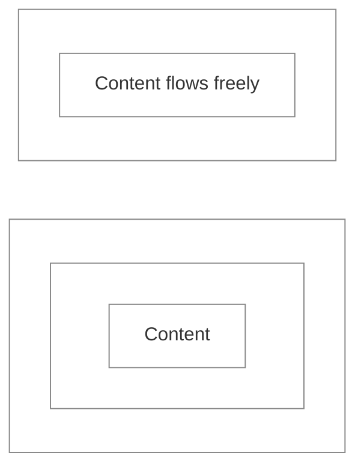

## Sitemap

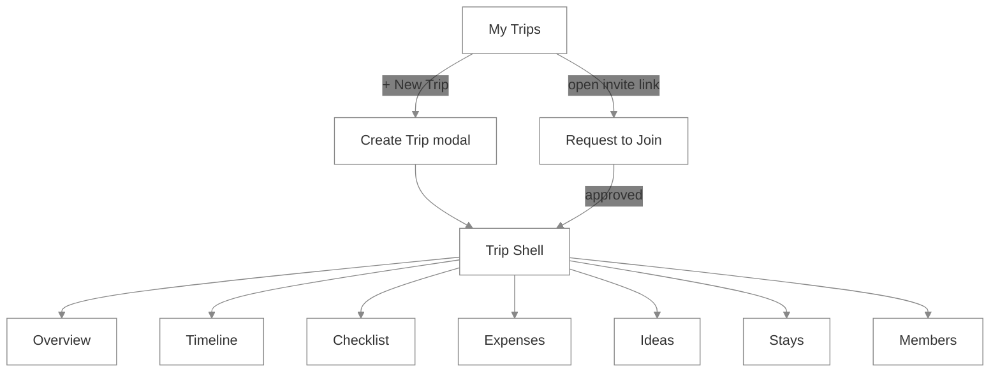

## Screens

*Every screen inside a trip shares a persistent header below the tab bar: trip title, destination badges, a separate line of general tags ("Guys Trip", "Couples Vacation"), and member avatars — so "the full view of the trip" always carries this, not just My Trips.*

**My Trips**
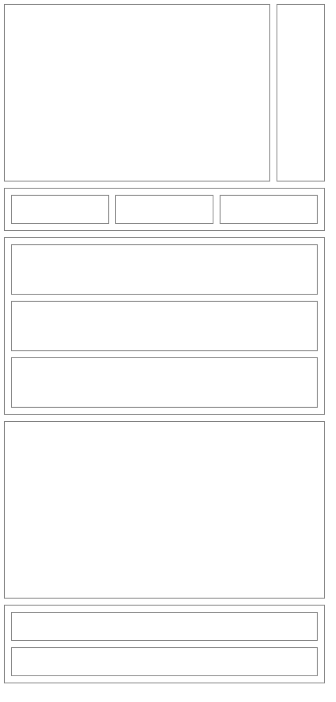
*One 6-column grid for the whole screen now — `Title`/`NewBtn` are a 5:1 width split, not equal boxes. Search/Filter/Sort are nested inside one Filters container, three-across, per your description. I added a `padding` hint to try shrinking `NewBtn`'s height, but that's not a documented, reliable block-beta property — width (the span) is still the lever that's actually guaranteed to work.*

**Sort**: alphabetical, start date, or end date — each ascending or descending.
**Filter**: status (live / pending / past), and destination. Filtering by destination implies `destinationLabel` needs to become an array of freeform strings (`destinationLabels: string[]`) rather than one label — e.g. a trip tagged both "Arizona" and "Grand Canyon" should surface under either filter term. Flagged for the TDD reconciliation pass.

**Destinations vs. tags — kept deliberately separate, not one combined row**: destination badges (Tokyo, Kyoto) describe *where*; tags (Guys Trip, Couples Vacation) describe *what kind of trip*. New `TripSpace.tags: string[]` field, freeform, same treatment as `destinationLabels` — flagged for the TDD reconciliation pass.

**Create Trip** (modal)
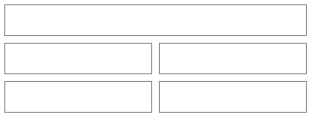
*Dates are back on the create form — every day-based feature needs a `startDate` to build on, so deferring them like destination/currency would leave Timeline with nothing to work from. Labeled as estimates, changeable anytime; destination, tags, currency, and cover image stay deferred to later.*

**Overview — pre-trip**
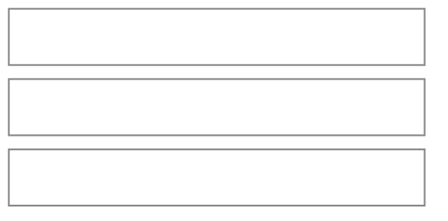
*Just an entry point now, not a duplicated mini-list — the Ideas screen already separates by type, so nothing here needs to repeat that.*

**Overview — live**
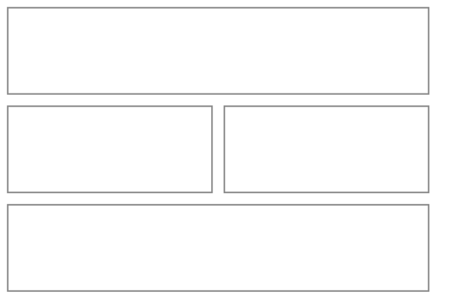
*Ideas and travel status moved up right below the Active Now hero — both collapsed by default (▸), expanding on tap rather than a persistent inline feed. I read "near the top" as "right below the hero," not literally above it, since Active Now is still the screen's whole reason for existing in live mode — flag it if you meant above.*

**Timeline**
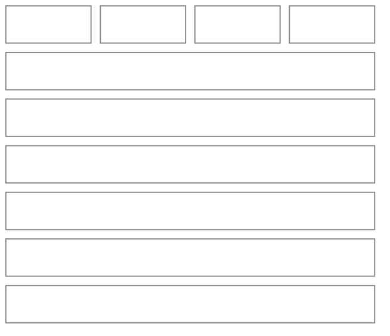
*One central "+ Add Event" right under the day tabs, not appended after the list — since the event's own day/time field is what determines where it lands, a single always-visible button reads better than implying "this only adds to the end," without the real complexity of buttons wedged between every pair of events.*

New elements, all flagged for the TDD reconciliation pass — and note the tiering, since this whole group is **not** MVP:
- **"All" tab** alongside the day tabs — a linear, unfiltered view of the whole trip, for whenever a specific day isn't what's needed.
- **Stay banner**: a persistent, thin strip at the top of each day naming that day's stay(s) — plural because a travel day can genuinely involve checking out of one place and into another, so it needs to support stacking two banners, not just one.
- **Auto-generated transit legs** (Next Steps, not MVP): a default `DRIVE` transit event is proposed before the first event of a day and between every consecutive pair, editable or removable — even a 10-minute walk is still a real commute worth accounting for. But downtime with no actual travel is just as real (a rest block between events isn't automatically a commute), so removing the proposed leg — or converting it straight into a Free Time event instead of a transit one — needs to be just as easy as accepting it. `Transit0`/`Transit1` above render as regular events in this diagram, but in the real UI they're meant to be visually thinner than a normal event card — not something Mermaid's height model can actually show, per the earlier limitation.
- **Travel-time/effort summary — removed from this diagram.** It was noise at the top of every day without more thought behind it — dynamic emoji by dominant travel method, an expandable breakdown, total effort/walking/standing as a future toggle — all of that is real but belongs in the README's Stretch Goals as a forward-looking idea, not sketched into the screen yet.

**Checklist** — the nested block shows one `Disclosure` group expanded
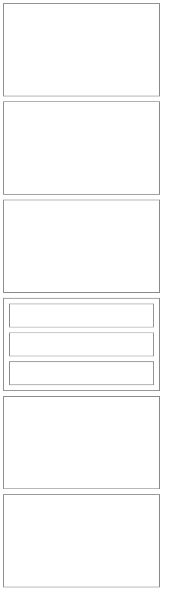
*👤 = the item's assignees (`assignedToUids`) — one icon per person, so "Adapter" with two icons means it's assigned to two people. The side-by-side layout on the items was a leftover from testing nested-block capability, not an actual design choice — a checklist is a vertical list, so it's fixed to stack now.*

**Expenses**
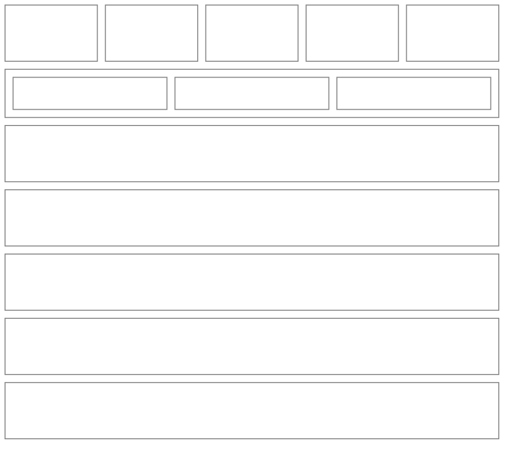
Reworked from the last pass, all flagged for the TDD reconciliation pass:
- **Grouped by day now**, mirroring Timeline's day tabs (including the same "All" option) rather than one flat running list — easier to reason about "what did we spend on Day 3." An **"Other" tab** holds expenses that aren't tied to any specific day — paying for the whole hotel stay upfront, for instance. This means `TripExpense` needs a nullable `dayIndex` it currently doesn't have at all.
- **Add and Dues are now separate blocks** — cramming "you owe Sam $4" and the add button into one node was genuinely confusing, not just a layout accident.
- **Add creates an expense; Split is a distinct, later step**, not the same action. Creating one only needs title, amount (or a range), and who paid — it defaults to split evenly among everyone, and "Split" is an explicit follow-up to customize that. See the reworked journey below.
- **Totals now show three figures**: paid-so-far, expected/upcoming, and their combined total — an expense can be a range instead of one fixed number ("$10-$30 est.") for cases like a farmer's market where the exact cost isn't known ahead of time, so "Total" is itself a range when any expected expense is.
- **Who an expense is for needs one more distinction than just "everyone"**: Everyone (current members only, a fixed snapshot) vs. Everyone (including anyone who joins later — a live reference) are genuinely different outcomes as the trip's membership changes, so both need to be offered explicitly rather than picking one silently. Alongside Just Me and Specific Members. Whichever is chosen, the split itself is auto-suggested (even, across whoever's included) and then freely adjustable or clearable — the whole flow needs to stay simple to use even with this extra choice built in.

**Ideas**
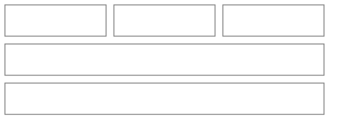

**Stays**
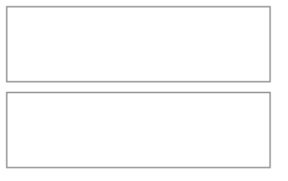

**Members**
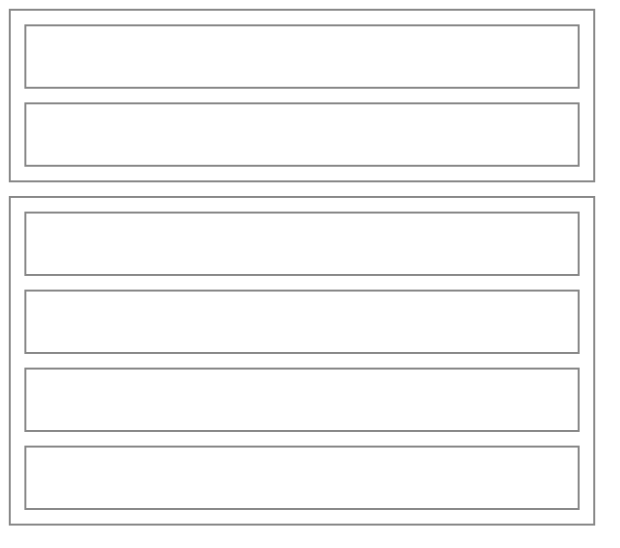
*Invite link is visible/copyable by any member — every join still routes through Admin approval regardless of who shared it. (Assumption, flagging it as one.)*

## Reusable Components

| Component | Used in | Purpose |
|---|---|---|
| `Card` (DreamerUI) | Trips, Events, Ideas, Expenses, Stays | the one bordered-container pattern, reused everywhere — DreamerUI already provides this, not a custom build |
| RoleBadge | Members, header | Admin / Editor / Commenter / Viewer pill — built on DreamerUI's `Badge`, not from scratch |
| MapNavigationButton | Timeline, Stays, Overview | 1-tap native map deep link — built on DreamerUI's `Button` with an icon; on small screens only Active Now / Up Next show it on the card |
| LocationLink | Timeline, Stays, Overview | the location text itself as the same map deep link, so directions are one tap even without a button |
| PlaceDetailsDrawer | Timeline, Stays (small screens) | tapping an event/stay card opens its full details in a DreamerUI `Drawer` with large Navigate / Visit site / Modify actions; larger screens keep the details and buttons on the card |
| ChangeBadge | Timeline, Overview | flags an edited event, expands to full history — built on DreamerUI's `Badge`/`Tooltip` |
| Avatar stack | Events, header, presence | overlapping member avatars — composed from the repo's existing central `UserAvatar.tsx`, not a new component |
| `Modal` (DreamerUI) | every `*FormModal` | consistent header / body / footer — DreamerUI's existing component, not a custom shell |
| FormSection (`Disclosure`) | Checklist, grouped forms | shared collapsible field-group wrapper, per the skill's central `src/ui/FormSection.tsx` |
| Empty state | any empty list | icon + line + one CTA — genuinely custom unless DreamerUI's catalog turns out to already cover this |
| `NavButton` (existing central `src/ui/`) | trip shell's Overview/Timeline/Checklist/etc. nav, My Trips ↔ a trip | real route changes, backed by react-router — not a generic tab component |
| Segmented filter (DreamerUI `Tabs`) | Ideas' type filter, My Trips' filter row | local filter state only, no route change |

## User Journeys

**Create a trip & invite**
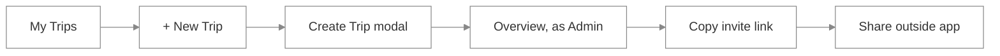

**Request to join**
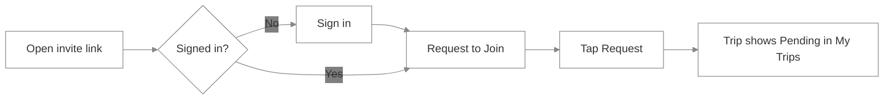
*Will eventually need real redirect/deep-link infrastructure (land on the right screen post-sign-in, handle the app not yet being installed, etc.) — a cross-app concern for every mini app with an invite link, not specific to Waypoint. Noting it here rather than solving it now.*

**Admin approves**
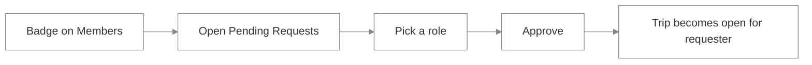

**Idea → itinerary** (one at a time, any time)
```mermaid
%%{init: {'theme': 'base', 'themeVariables': {'primaryColor': 'transparent', 'clusterBkg': 'transparent', 'primaryBorderColor': '#888888', 'clusterBorder': '#888888', 'lineColor': '#888888', 'primaryTextColor': '#333333'}}}%%
flowchart LR
    A[Overview: Ideas] --> B[Post a Restaurant idea] --> C[Others upvote] --> D[Add to Itinerary] --> E[Event modal, pre-filled] --> F[Pick day + time] --> G[Appears on Timeline]
```

**Plan itinerary from ideas** (batch, once the group's decided)
```mermaid
%%{init: {'theme': 'base', 'themeVariables': {'primaryColor': 'transparent', 'clusterBkg': 'transparent', 'primaryBorderColor': '#888888', 'clusterBorder': '#888888', 'lineColor': '#888888', 'primaryTextColor': '#333333'}}}%%
flowchart LR
    A[Ideas screen] --> B[Pick the winning Stay first] --> C[Select as Stay]
    C --> D[Pick winning Restaurant/Activity ideas]
    D --> E[Build Itinerary from Ideas]
    E --> F[Each pre-fills a day/time from votes + suggested time block]
    F --> G[Confirm or adjust each] --> H[All appear on Timeline]
```
*Starts with the Stay deliberately — everything else about a day (which city, which events make sense) hangs off where the group is actually staying. This needs a corresponding bulk-conversion action in the eventual TDD pass; not designing that now.*

**Navigate to an event**
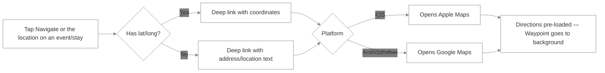
*This exits Waypoint entirely — it's a native map deep link, not an in-app map screen. No lat/long (e.g. Free Time's general area) falls back to a text query instead of coordinates.*

**Adding an event auto-proposes the commute** (Next Steps, not MVP)
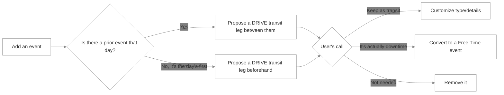
*Defaults to driving since that's the most common case, but downtime between events (no real travel happening) is just as common — converting straight to Free Time needs to be as easy as accepting the default, not just delete-or-keep. The total-travel-time rollup this would have fed is a separate, Stretch-tier idea — see Timeline above.*

**Add & split an expense**
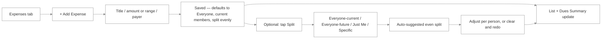
*Everyone-current and Everyone-including-future-members are kept as separate choices, not folded into one "Everyone" — they produce genuinely different outcomes once someone new joins after the expense exists.*
*Add and Split are genuinely two different actions now — creating the expense is the fast path with a sensible default, and Split is there for whenever the default doesn't match reality.*

**Live trip, day-of**
```mermaid
%%{init: {'theme': 'base', 'themeVariables': {'primaryColor': 'transparent', 'clusterBkg': 'transparent', 'primaryBorderColor': '#888888', 'clusterBorder': '#888888', 'lineColor': '#888888', 'primaryTextColor': '#333333'}}}%%
flowchart LR
    A[Overview → HUD] --> B[Active Now / Up Next] --> C[Tap map nav]
    A --> D[Post travel status]
    A --> E[Admin edits event time] --> F[ChangeBadge shown to everyone]
```

**End-of-day album reminder**
```mermaid
%%{init: {'theme': 'base', 'themeVariables': {'primaryColor': 'transparent', 'clusterBkg': 'transparent', 'primaryBorderColor': '#888888', 'clusterBorder': '#888888', 'lineColor': '#888888', 'primaryTextColor': '#333333'}}}%%
flowchart LR
    A[Day or trip nears its end] --> B[Reminder banner appears on Overview] --> C[Tap the album link] --> D[Opens external album to add today's photos]
```
*This was already designed at the TDD level (State Machine 7 — a plain visibility check, no push notification) but hadn't been captured as its own journey until now.*

**Remove a member**
```mermaid
%%{init: {'theme': 'base', 'themeVariables': {'primaryColor': 'transparent', 'clusterBkg': 'transparent', 'primaryBorderColor': '#888888', 'clusterBorder': '#888888', 'lineColor': '#888888', 'primaryTextColor': '#333333'}}}%%
flowchart LR
    A[Members, Admin] --> B[Select member] --> C[Remove] --> D[Confirm] --> E[Access revoked, history intact]
```

## Form Field Organization

*"Grouping: none" means a single flat form — it still uses DreamerUI's `Form` component per the Design Principles above, just without a `Disclosure`/Steps wrapper around it.*

| Entity | Initial (create) | Later (edit only) | Grouping |
|---|---|---|---|
| Trip Space | title, start/end dates (framed as estimates) | destination labels, tags, currency, cover image | none |
| Timeline Event | `eventType` (category: Travel/Dining/Activity/Free Time), title, day, start time, that category's one quick field (see below), location, assignees (which members are involved) | end time/day, address, notes, finer transit/dining fields | **Steps** |
| Stay | name, address, official check-in/out | confirmation code, notes¹ | none |
| Checklist Item | title, category (incl. a custom "Other" option with its own label), assignees | — | none |
| Expense | title, amount (or a min-max range), currency (defaulted), payer, day (or "Other" for none) | target — Everyone (current), Everyone (incl. future), Just Me, or Specific — + auto-suggested even split, adjustable; status (paid vs. expected/upcoming) | none — Split is a distinct follow-up action, not a later *field* |
| Comment/Proposal | text (+ proposal fields) | — | none |
| Idea — Restaurant | title, link, cuisines, suggested time block(s)³, suggested day(s)³ | notes | none |
| Idea — Activity | title, link, settings (indoor/outdoor, multi-select), suggested time block(s)³, suggested day(s)³ | notes | none |
| Idea — Stay | title, link, location | criteria, perks, notes | none |
| Stay Criterion | label (the criterion itself, e.g. "Near a train station"), tier (must-have vs. nice-to-have) | — | none |
| Live Travel Status | status, note | — | none² |
| Shared Album Link | url | — | none |

¹ `plannedArrivalAt`/`plannedDepartureAt` default to the official check-in/out and are never asked on create.
² Possible exception to the forms-in-modal default — see Design Principles.
³ Time blocks are Morning/Afternoon/Evening, multi-select — an idea can genuinely fit more than one (brunch is Morning *and* Afternoon). Suggested days are specific trip days (multi-select, empty = no preference — e.g. lunch works any day), for cases like "we just arrive that evening, so it fits day 1 specifically." Both are kept as two independent lists rather than paired day+time slots, since a clean way to encapsulate the paired version didn't fall out easily. Feeds the batch "Plan itinerary from ideas" journey above: the winning idea's suggestions pre-fill a starting day/time, which the user still confirms or adjusts, not auto-commits.