# Waypoint — UX & Interaction Design

## Design Principles

| Principle | Means |
|---|---|
| One border, not nested ones | a card gets a single bordered shell with a flat interior — never border-in-a-border |
| Mobile-first | single narrow column, bottom tab bar, full-width forms — wider screens reflow the same components, no parallel desktop layout |
| One card shell, everywhere | trips, events, ideas, expenses, stays all render as the same card pattern |
| DreamerUI first | `Form`, `Disclosure`, `Modal`, tabs — nothing bespoke unless the catalog doesn't cover it |
| Real empty states | icon + one line + one call-to-action, never a bare blank list |
| Stay on the screen, surface detail via overlay | modal/popover/drawer for anything short of switching between the trip's core sections — no full-page navigations within a tab. Honest caveat: a single truly-one-screen app isn't realistic given how many distinct concerns Waypoint has (timeline, checklist, expenses, ideas, stays, members) — the trip shell's tabs are the necessary compromise. The principle applies *within* each tab, not to collapsing all seven into one. |

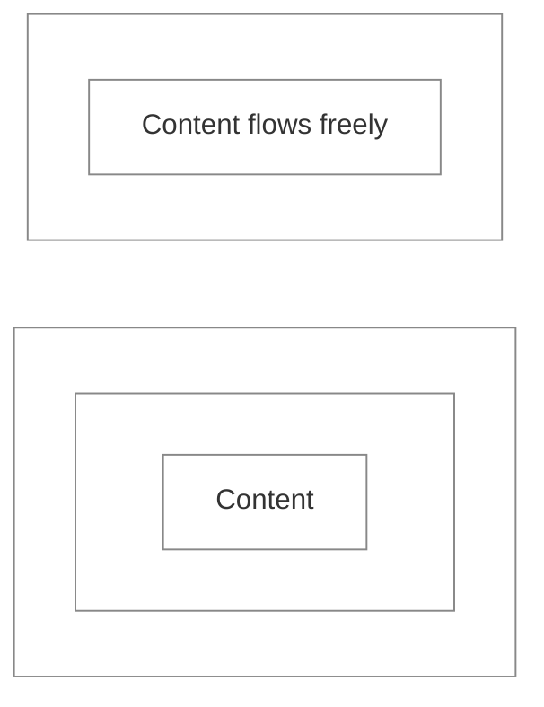
```mermaid
%%{init: {'theme': 'base', 'themeVariables': {'primaryColor': 'transparent', 'clusterBkg': 'transparent', 'primaryBorderColor': '#888888', 'clusterBorder': '#888888', 'lineColor': '#888888', 'primaryTextColor': '#333333'}}}%%
flowchart LR
    subgraph Bad["❌ Nested borders"]
        subgraph BadInner[" "]
            BadContent["Content"]
        end
    end
    subgraph Good["✅ Single shell"]
        GoodContent["Content flows freely"]
    end
    style Bad fill:transparent,stroke:#888888,stroke-width:1px;
    style BadInner fill:transparent,stroke:#888888,stroke-width:1px;
    style Good fill:transparent,stroke:#888888,stroke-width:1px;
```

## Sitemap

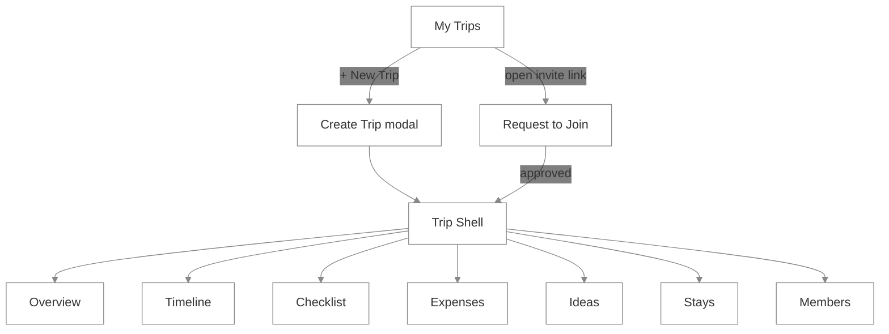
```mermaid
%%{init: {'theme': 'base', 'themeVariables': {'primaryColor': 'transparent', 'clusterBkg': 'transparent', 'primaryBorderColor': '#888888', 'clusterBorder': '#888888', 'lineColor': '#888888', 'primaryTextColor': '#333333'}}}%%
flowchart TD
    A[My Trips] -->|+ New Trip| B[Create Trip modal]
    A -->|open invite link| C[Request to Join]
    B --> D[Trip Shell]
    C -->|approved| D
    D --> E[Overview]
    D --> F[Timeline]
    D --> G[Checklist]
    D --> H[Expenses]
    D --> I[Ideas]
    D --> J[Stays]
    D --> K[Members]
```

## Screens

*Every screen inside a trip shares a persistent header below the tab bar: trip title, destination badges, a separate line of general tags ("Guys Trip", "Couples Vacation"), and member avatars — so "the full view of the trip" always carries this, not just My Trips.*

**My Trips**
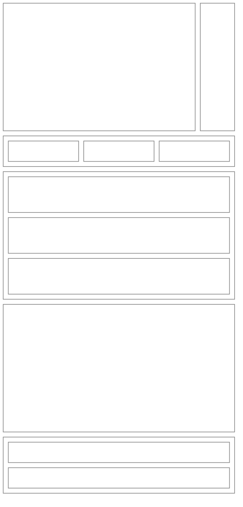
```mermaid
%%{init: {'theme': 'base', 'themeVariables': {'primaryColor': 'transparent', 'primaryBorderColor': '#888888', 'primaryTextColor': '#333333', 'lineColor': '#888888'}}}%%
block-beta
  columns 6
  Title["My Trips"]:5
  NewBtn["+ New"]:1
  block:FilterGroup:6
    columns 3
    Search["🔍 Search"]
    Filter["▾ Filter"]
    Sort["▾ Sort"]
  end
  block:Trip1Card:6
    columns 1
    Trip1Main["🖼️ Tokyo Summer 2026 — 🟢 Live<br/>Jun 9 - Jun 16"]
    Trip1Dest["📍 Tokyo   📍 Kyoto"]
    Trip1Tags["🏷️ Guys Trip"]
  end
  Trip2["🖼️ Ski Trip 2027<br/>Feb 2 - Feb 6"]:6
  block:PendingGroup:6
    columns 1
    PendingLabel["PENDING"]
    Pending1["⏳ Bachelor Party — waiting"]
  end
  style Title fill:transparent,stroke:#888888,stroke-width:1px;
  style NewBtn fill:transparent,stroke:#888888,stroke-width:1px,padding:2px;
  style FilterGroup fill:transparent,stroke:#888888,stroke-width:1px;
  style Search fill:transparent,stroke:#888888,stroke-width:1px;
  style Filter fill:transparent,stroke:#888888,stroke-width:1px;
  style Sort fill:transparent,stroke:#888888,stroke-width:1px;
  style Trip1Card fill:transparent,stroke:#888888,stroke-width:1px;
  style Trip1Main fill:transparent,stroke:#888888,stroke-width:1px;
  style Trip1Dest fill:transparent,stroke:#888888,stroke-width:1px;
  style Trip1Tags fill:transparent,stroke:#888888,stroke-width:1px;
  style Trip2 fill:transparent,stroke:#888888,stroke-width:1px;
  style PendingGroup fill:transparent,stroke:#888888,stroke-width:1px;
  style PendingLabel fill:transparent,stroke:#888888,stroke-width:1px;
  style Pending1 fill:transparent,stroke:#888888,stroke-width:1px;
```
*One 6-column grid for the whole screen now — `Title`/`NewBtn` are a 5:1 width split, not equal boxes. Search/Filter/Sort are nested inside one Filters container, three-across, per your description. I added a `padding` hint to try shrinking `NewBtn`'s height, but that's not a documented, reliable block-beta property — width (the span) is still the lever that's actually guaranteed to work.*

**Sort**: alphabetical, start date, or end date — each ascending or descending.
**Filter**: status (live / pending / past), and destination. Filtering by destination implies `destinationLabel` needs to become an array of freeform strings (`destinationLabels: string[]`) rather than one label — e.g. a trip tagged both "Arizona" and "Grand Canyon" should surface under either filter term. Flagged for the TDD reconciliation pass.

**Destinations vs. tags — kept deliberately separate, not one combined row**: destination badges (Tokyo, Kyoto) describe *where*; tags (Guys Trip, Couples Vacation) describe *what kind of trip*. New `TripSpace.tags: string[]` field, freeform, same treatment as `destinationLabels` — flagged for the TDD reconciliation pass.

**Create Trip** (modal)
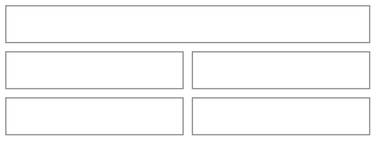
```mermaid
%%{init: {'theme': 'base', 'themeVariables': {'primaryColor': 'transparent', 'primaryBorderColor': '#888888', 'primaryTextColor': '#333333', 'lineColor': '#888888'}}}%%
block-beta
  columns 2
  F1["Title"]:2
  F2["Start date (estimate)"]:1
  F3["End date (estimate)"]:1
  Cancel["Cancel"]:1
  Create["Create"]:1
  style F1 fill:transparent,stroke:#888888,stroke-width:1px;
  style F2 fill:transparent,stroke:#888888,stroke-width:1px;
  style F3 fill:transparent,stroke:#888888,stroke-width:1px;
  style Cancel fill:transparent,stroke:#888888,stroke-width:1px;
  style Create fill:transparent,stroke:#888888,stroke-width:1px;
```
*Dates are back on the create form — every day-based feature needs a `startDate` to build on, so deferring them like destination/currency would leave Timeline with nothing to work from. Labeled as estimates, changeable anytime; destination, tags, currency, and cover image stay deferred to later.*

**Overview — pre-trip**
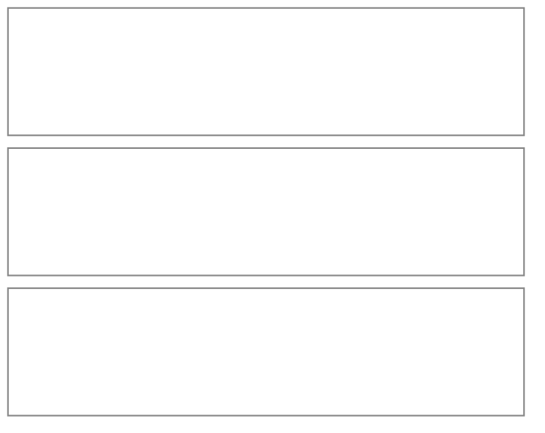
```mermaid
%%{init: {'theme': 'base', 'themeVariables': {'primaryColor': 'transparent', 'primaryBorderColor': '#888888', 'primaryTextColor': '#333333', 'lineColor': '#888888'}}}%%
block-beta
  columns 1
  Ideas["💡 Ideas for the trip<br/>🍣 Sushi Dai ▲12 · 🥾 Rattlesnake Ledge ▲7<br/>+ Add an idea · See all ›"]
  Checklist["▓▓▓▓▓░░░ Checklist progress"]
  Album["🔗 Shared album link"]
  style Ideas fill:transparent,stroke:#888888,stroke-width:1px;
  style Checklist fill:transparent,stroke:#888888,stroke-width:1px;
  style Album fill:transparent,stroke:#888888,stroke-width:1px;
```
*A prominent card with an Activities / Restaurants toggle (Activities first), the top three undecided ideas of that type with inline voting, and an add button; tapping an idea opens its details (a drawer with a big centered vote on phones, a popover on wider screens) — pre-trip is when ideas matter, so Overview asks people to act on them right here. New ideas close once the trip starts; the card then becomes a quiet "Ideas" row (phones) and the Ideas tab (desktop), and voting stays open.*

**Overview — live**
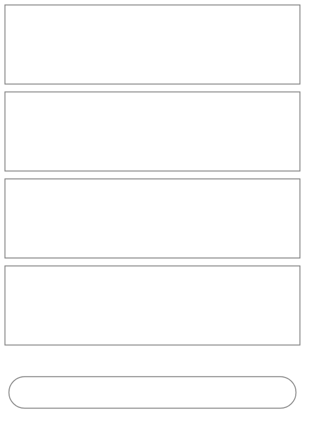
```mermaid
%%{init: {'theme': 'base', 'themeVariables': {'primaryColor': 'transparent', 'primaryBorderColor': '#888888', 'primaryTextColor': '#333333', 'lineColor': '#888888'}}}%%
block-beta
  columns 2
  Pills["Members · Checklist · Stays · Rentals"]:2
  CheckIn["CHECKING IN TODAY<br/>🛏️ Hotel · 3 PM"]:2
  Agenda["TODAY<br/>✓ Breakfast · 8 AM<br/>🍜 Dinner · 6 PM"]:2
  IdeasCollapsed["💡 Ideas (3 new) ▸"]:2
  Pill(["● NOW · 12m left — Dinner  ›  [Up next]"]):2
  style Pills fill:transparent,stroke:#888888,stroke-width:1px;
  style CheckIn fill:transparent,stroke:#888888,stroke-width:1px;
  style Agenda fill:transparent,stroke:#888888,stroke-width:1px;
  style IdeasCollapsed fill:transparent,stroke:#888888,stroke-width:1px;
  style Pill fill:transparent,stroke:#888888,stroke-width:1px;
```
*What is happening now and what comes next float as one pill over the main screens (Overview, Timeline, Expenses): it shows what is on, one button swaps to what is next, and a tap opens the details. The page keeps the static hub (today's check-ins and pickups, weather, agenda) and the entries to members, checklist, stays and rentals sit in one row at the top, with ideas below.*

**Timeline**
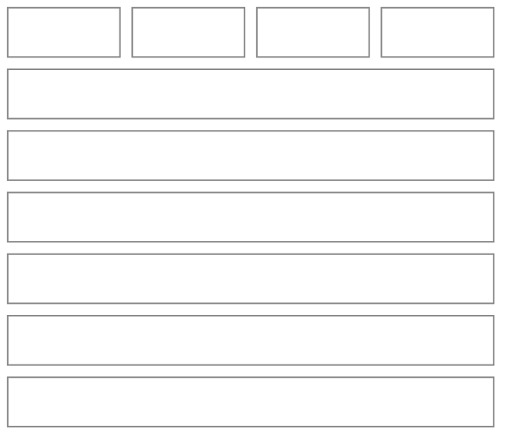
```mermaid
%%{init: {'theme': 'base', 'themeVariables': {'primaryColor': 'transparent', 'primaryBorderColor': '#888888', 'primaryTextColor': '#333333', 'lineColor': '#888888'}}}%%
block-beta
  columns 4
  DayAll["All"]:1
  Day1["Day 1"]:1
  Day2["Day 2"]:1
  Day3["Day 3 ···"]:1
  StayBanner["🏨 Staying at: Shibuya Sky Hotel"]:4
  Add["+ Add Event"]:4
  Transit0["🚗 10 min drive (auto)"]:4
  E1["🛫 Flight to Tokyo · 8:00 AM · Navigate"]:4
  Transit1["🚗 15 min drive (auto)"]:4
  E2["🍜 Lunch — Ichiran · 1:00 PM · Navigate"]:4
  style DayAll fill:transparent,stroke:#888888,stroke-width:1px;
  style Day1 fill:transparent,stroke:#888888,stroke-width:1px;
  style Day2 fill:transparent,stroke:#888888,stroke-width:1px;
  style Day3 fill:transparent,stroke:#888888,stroke-width:1px;
  style StayBanner fill:transparent,stroke:#888888,stroke-width:1px;
  style Add fill:transparent,stroke:#888888,stroke-width:1px;
  style Transit0 fill:transparent,stroke:#888888,stroke-width:1px;
  style E1 fill:transparent,stroke:#888888,stroke-width:1px;
  style Transit1 fill:transparent,stroke:#888888,stroke-width:1px;
  style E2 fill:transparent,stroke:#888888,stroke-width:1px;
```
*One central "+ Add Event" right under the day tabs, not appended after the list — since the event's own day/time field is what determines where it lands, a single always-visible button reads better than implying "this only adds to the end," without the real complexity of buttons wedged between every pair of events.*

New elements, all flagged for the TDD reconciliation pass — and note the tiering, since this whole group is **not** MVP:
- **"All" tab** alongside the day tabs — a linear, unfiltered view of the whole trip, for whenever a specific day isn't what's needed.
- **Stay banner**: a persistent, thin strip at the top of each day naming that day's stay(s) — plural because a travel day can genuinely involve checking out of one place and into another, so it needs to support stacking two banners, not just one.
- **Auto-generated transit legs** (Next Steps, not MVP): a default `DRIVE` transit event is proposed before the first event of a day and between every consecutive pair, editable or removable — even a 10-minute walk is still a real commute worth accounting for. But downtime with no actual travel is just as real (a rest block between events isn't automatically a commute), so removing the proposed leg — or converting it straight into a Free Time event instead of a transit one — needs to be just as easy as accepting it. `Transit0`/`Transit1` above render as regular events in this diagram, but in the real UI they're meant to be visually thinner than a normal event card — not something Mermaid's height model can actually show, per the earlier limitation.
- **Travel-time/effort summary — removed from this diagram.** It was noise at the top of every day without more thought behind it — dynamic emoji by dominant travel method, an expandable breakdown, total effort/walking/standing as a future toggle — all of that is real but belongs in the README's Stretch Goals as a forward-looking idea, not sketched into the screen yet.

**Checklist** — the nested block shows one `Disclosure` group expanded
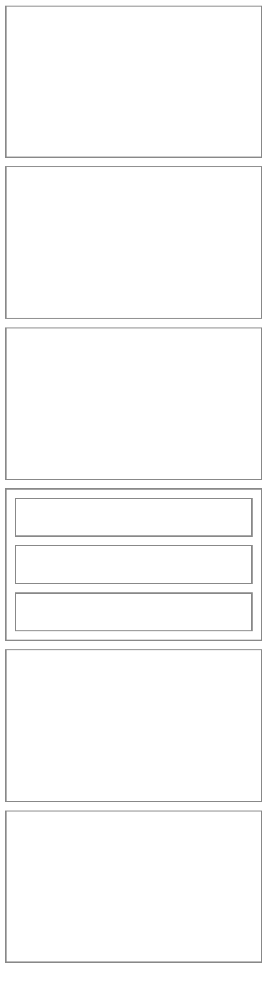
```mermaid
%%{init: {'theme': 'base', 'themeVariables': {'primaryColor': 'transparent', 'primaryBorderColor': '#888888', 'primaryTextColor': '#333333', 'lineColor': '#888888'}}}%%
block-beta
  columns 1
  Progress["▓▓▓▓▓▓▓░░░ 62% packed"]
  FilterMine["☐ Show only my items"]
  Documents["▸ Documents (3)"]
  block:PackingGroup
    columns 1
    PackingLabel["▾ Packing (5)"]
    Item1["☑ Passport — 👤"]
    Item2["☐ Adapter — 👤👤"]
  end
  Bookings["▸ Bookings (2)"]
  Logistics["▸ Logistics (1)"]
  style Progress fill:transparent,stroke:#888888,stroke-width:1px;
  style FilterMine fill:transparent,stroke:#888888,stroke-width:1px;
  style Documents fill:transparent,stroke:#888888,stroke-width:1px;
  style PackingGroup fill:transparent,stroke:#888888,stroke-width:1px;
  style PackingLabel fill:transparent,stroke:#888888,stroke-width:1px;
  style Item1 fill:transparent,stroke:#888888,stroke-width:1px;
  style Item2 fill:transparent,stroke:#888888,stroke-width:1px;
  style Bookings fill:transparent,stroke:#888888,stroke-width:1px;
  style Logistics fill:transparent,stroke:#888888,stroke-width:1px;
```
*👤 = the item's assignees (`assignedToUids`) — one icon per person, so "Adapter" with two icons means it's assigned to two people. The side-by-side layout on the items was a leftover from testing nested-block capability, not an actual design choice — a checklist is a vertical list, so it's fixed to stack now.*

**Expenses**
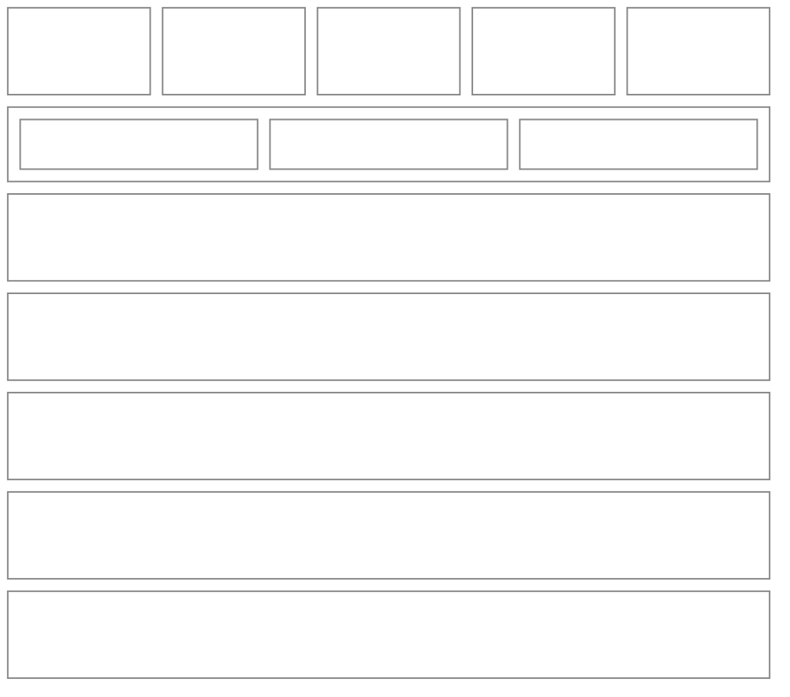
```mermaid
%%{init: {'theme': 'base', 'themeVariables': {'primaryColor': 'transparent', 'primaryBorderColor': '#888888', 'primaryTextColor': '#333333', 'lineColor': '#888888'}}}%%
block-beta
  columns 5
  DayAll["All"]:1
  Day1["Day 1"]:1
  Day2["Day 2"]:1
  Day3["Day 3 ···"]:1
  DayOther["Other"]:1
  block:Totals:5
    columns 3
    TotalPaid["Paid so far: $180"]
    TotalExpected["Expected: $60-$90"]
    TotalAll["Total: $240-$270"]
  end
  Dues["You owe Sam: $4"]:5
  AddBtn["+ Add Expense"]:5
  Ex1["Ramen dinner — $42<br/>paid by Sam · split 3 ways"]:5
  Ex2["Taxi — $18<br/>paid by you · everyone"]:5
  Ex3["Farmer's market — $10-$30 est.<br/>upcoming"]:5
  style DayAll fill:transparent,stroke:#888888,stroke-width:1px;
  style Day1 fill:transparent,stroke:#888888,stroke-width:1px;
  style Day2 fill:transparent,stroke:#888888,stroke-width:1px;
  style Day3 fill:transparent,stroke:#888888,stroke-width:1px;
  style DayOther fill:transparent,stroke:#888888,stroke-width:1px;
  style Totals fill:transparent,stroke:#888888,stroke-width:1px;
  style TotalPaid fill:transparent,stroke:#888888,stroke-width:1px;
  style TotalExpected fill:transparent,stroke:#888888,stroke-width:1px;
  style TotalAll fill:transparent,stroke:#888888,stroke-width:1px;
  style Dues fill:transparent,stroke:#888888,stroke-width:1px;
  style AddBtn fill:transparent,stroke:#888888,stroke-width:1px;
  style Ex1 fill:transparent,stroke:#888888,stroke-width:1px;
  style Ex2 fill:transparent,stroke:#888888,stroke-width:1px;
  style Ex3 fill:transparent,stroke:#888888,stroke-width:1px;
```
Reworked from the last pass, all flagged for the TDD reconciliation pass:
- **Grouped by day now**, mirroring Timeline's day tabs (including the same "All" option) rather than one flat running list — easier to reason about "what did we spend on Day 3." An **"Other" tab** holds expenses that aren't tied to any specific day — paying for the whole hotel stay upfront, for instance. This means `TripExpense` needs a nullable `dayIndex` it currently doesn't have at all.
- **Add and Dues are now separate blocks** — cramming "you owe Sam $4" and the add button into one node was genuinely confusing, not just a layout accident.
- **Add creates an expense; Split is a distinct, later step**, not the same action. Creating one only needs title, amount (or a range) (and "Add and mark paid" records it as paid by the person adding) and it defaults to split evenly among everyone, and "Split" is an explicit follow-up to customize that. See the reworked journey below.
- **Totals have three views (Per person, Group, Mine) as pills**; Mine shows what you paid, what is still expected for you and your total share, and a muted line for money you sent early. Each view shows three figures: paid-so-far, expected/upcoming, and their combined total — an expense can be a range instead of one fixed number ("$10-$30 est.") for cases like a farmer's market where the exact cost isn't known ahead of time, so "Total" is itself a range when any expected expense is.
- **Who an expense is for needs one more distinction than just "everyone"**: Everyone (current members only, a fixed snapshot) vs. Everyone (including anyone who joins later — a live reference) are genuinely different outcomes as the trip's membership changes. The split editor offers Everyone (current members) and Pick people; the other two kinds are only read from older expenses. Whichever is chosen, the split itself is auto-suggested (even, across whoever's included) and then freely adjustable or clearable — the whole flow needs to stay simple to use even with this extra choice built in.

**Ideas**
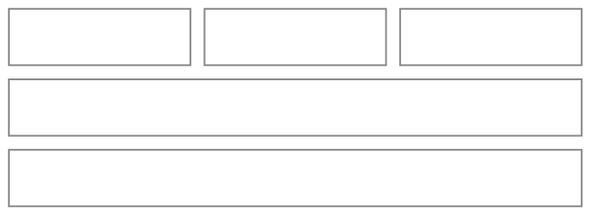
```mermaid
%%{init: {'theme': 'base', 'themeVariables': {'primaryColor': 'transparent', 'primaryBorderColor': '#888888', 'primaryTextColor': '#333333', 'lineColor': '#888888'}}}%%
block-beta
  columns 3
  FilterR["[Restaurant]"]:1
  FilterA["Activity"]:1
  FilterS["Stay"]:1
  Idea1["🍣 Sushi Dai ▲12 · link ↗ · Add to Itinerary"]:3
  Idea2["🍜 Ichiran ▲7 · Add to Itinerary"]:3
  style FilterR fill:transparent,stroke:#888888,stroke-width:1px;
  style FilterA fill:transparent,stroke:#888888,stroke-width:1px;
  style FilterS fill:transparent,stroke:#888888,stroke-width:1px;
  style Idea1 fill:transparent,stroke:#888888,stroke-width:1px;
  style Idea2 fill:transparent,stroke:#888888,stroke-width:1px;
```

**Stays**
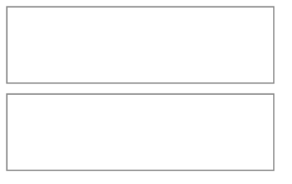
```mermaid
%%{init: {'theme': 'base', 'themeVariables': {'primaryColor': 'transparent', 'primaryBorderColor': '#888888', 'primaryTextColor': '#333333', 'lineColor': '#888888'}}}%%
block-beta
  columns 1
  St1["🏨 Shibuya Sky Hotel<br/>Jun 9 - Jun 12 · Navigate"]
  St2["🏨 Kyoto Ryokan<br/>Jun 12 - Jun 16 · Navigate"]
  style St1 fill:transparent,stroke:#888888,stroke-width:1px;
  style St2 fill:transparent,stroke:#888888,stroke-width:1px;
```

**Members**
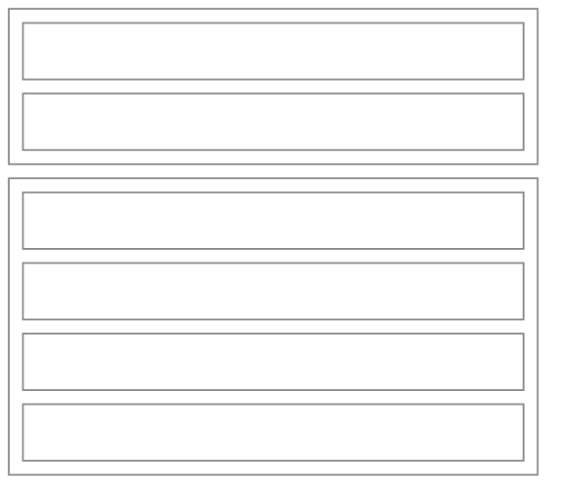
```mermaid
%%{init: {'theme': 'base', 'themeVariables': {'primaryColor': 'transparent', 'primaryBorderColor': '#888888', 'primaryTextColor': '#333333', 'lineColor': '#888888'}}}%%
block-beta
  columns 1
  block:PendingGroup
    columns 1
    PendingLabel["PENDING (2)"]
    Req1["Jordan — 2h ago · Decline · Approve ▾"]
  end
  block:MembersGroup
    columns 1
    MembersLabel["MEMBERS"]
    M1["👤 You — ADMIN"]
    M2["👤 Sam — EDITOR ⋮"]
    M3["👤 Alex — VIEWER ⋮"]
  end
  style PendingGroup fill:transparent,stroke:#888888,stroke-width:1px;
  style PendingLabel fill:transparent,stroke:#888888,stroke-width:1px;
  style Req1 fill:transparent,stroke:#888888,stroke-width:1px;
  style MembersGroup fill:transparent,stroke:#888888,stroke-width:1px;
  style MembersLabel fill:transparent,stroke:#888888,stroke-width:1px;
  style M1 fill:transparent,stroke:#888888,stroke-width:1px;
  style M2 fill:transparent,stroke:#888888,stroke-width:1px;
  style M3 fill:transparent,stroke:#888888,stroke-width:1px;
```
*Invite link is visible/copyable by any member — every join still routes through Admin approval regardless of who shared it. (Assumption, flagging it as one.)*

## Reusable Components

| Component | Used in | Purpose |
|---|---|---|
| `Card` (DreamerUI) | Trips, Events, Ideas, Expenses, Stays | the one bordered-container pattern, reused everywhere — DreamerUI already provides this, not a custom build |
| RoleBadge | Members, header | Admin / Editor / Commenter / Viewer pill — built on DreamerUI's `Badge`, not from scratch |
| MapNavigationButton | Timeline, Stays, Overview | 1-tap native map deep link — built on DreamerUI's `Button` with an icon; on small screens only the Now / Up next details show it |
| LocationLink | Timeline, Stays, Overview | the location text itself as the same map deep link, so directions are one tap even without a button |
| PlaceDetailsDrawer | Timeline, Stays (small screens) | tapping an event/stay card opens its full details in a DreamerUI `Drawer` with large Navigate / Visit site / Modify actions; larger screens keep the details and buttons on the card |
| NotesField | Timeline & Stays cards, PlaceDetailsDrawer | an event's or stay's note as its own entry outside the event/stay form — muted left-bar text, with a subtle pencil button on larger cards and an "+ Add note" link in the drawer; editable by whoever can edit the event |
| ChangeBadge | Timeline, Overview | flags an edited event, expands to full history — built on DreamerUI's `Badge`/`Tooltip` |
| Avatar stack | Events, header, presence | overlapping member avatars — composed from the repo's existing central `UserAvatar.tsx`, not a new component |
| `Modal` (DreamerUI) | every `*FormModal` | consistent header / body / footer — DreamerUI's existing component, not a custom shell |
| FormSection (`Disclosure`) | Checklist, grouped forms | shared collapsible field-group wrapper, per the skill's central `src/ui/FormSection.tsx` |
| Empty state | any empty list | icon + line + one CTA — genuinely custom unless DreamerUI's catalog turns out to already cover this |
| `NavButton` (existing central `src/ui/`) | trip shell's Overview/Timeline/Checklist/etc. nav, My Trips ↔ a trip | real route changes, backed by react-router — not a generic tab component |
| Segmented filter (DreamerUI `Tabs`) | Ideas' type filter, My Trips' filter row | local filter state only, no route change |

## User Journeys

**Create a trip & invite**
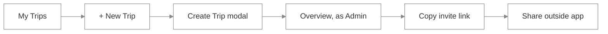
```mermaid
%%{init: {'theme': 'base', 'themeVariables': {'primaryColor': 'transparent', 'clusterBkg': 'transparent', 'primaryBorderColor': '#888888', 'clusterBorder': '#888888', 'lineColor': '#888888', 'primaryTextColor': '#333333'}}}%%
flowchart LR
    A[My Trips] --> B[+ New Trip] --> C[Create Trip modal] --> D[Overview, as Admin] --> E[Copy invite link] --> F[Share outside app]
```

**Request to join**
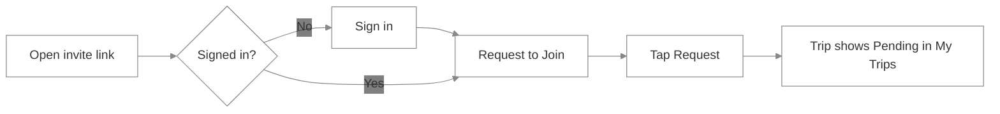
```mermaid
%%{init: {'theme': 'base', 'themeVariables': {'primaryColor': 'transparent', 'clusterBkg': 'transparent', 'primaryBorderColor': '#888888', 'clusterBorder': '#888888', 'lineColor': '#888888', 'primaryTextColor': '#333333'}}}%%
flowchart LR
    A[Open invite link] --> B{Signed in?}
    B -->|No| C[Sign in] --> D[Request to Join]
    B -->|Yes| D
    D --> E[Tap Request] --> F["Trip shows Pending in My Trips"]
```
*Will eventually need real redirect/deep-link infrastructure (land on the right screen post-sign-in, handle the app not yet being installed, etc.) — a cross-app concern for every mini app with an invite link, not specific to Waypoint. Noting it here rather than solving it now.*

**Admin approves**
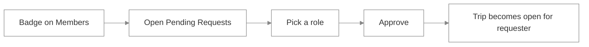
```mermaid
%%{init: {'theme': 'base', 'themeVariables': {'primaryColor': 'transparent', 'clusterBkg': 'transparent', 'primaryBorderColor': '#888888', 'clusterBorder': '#888888', 'lineColor': '#888888', 'primaryTextColor': '#333333'}}}%%
flowchart LR
    A[Badge on Members] --> B[Open Pending Requests] --> C[Pick a role] --> D[Approve] --> E[Trip becomes open for requester]
```

**Idea → itinerary** (one at a time, any time)

```mermaid
%%{init: {'theme': 'base', 'themeVariables': {'primaryColor': 'transparent', 'clusterBkg': 'transparent', 'primaryBorderColor': '#888888', 'clusterBorder': '#888888', 'lineColor': '#888888', 'primaryTextColor': '#333333'}}}%%
flowchart LR
    A[Overview: Ideas] --> B[Post a Restaurant idea] --> C[Others upvote] --> D[Add to Itinerary] --> L[Look the idea up in Places] --> E[Event form, pre-filled: place and address, or the idea's title if nothing is found] --> F[Pick day + time] --> G[Appears on Timeline] --> H[Offer an expense and a checklist item, pre-filled]
```

**Plan itinerary from ideas** (batch, once the group's decided)

```mermaid
%%{init: {'theme': 'base', 'themeVariables': {'primaryColor': 'transparent', 'clusterBkg': 'transparent', 'primaryBorderColor': '#888888', 'clusterBorder': '#888888', 'lineColor': '#888888', 'primaryTextColor': '#333333'}}}%%
flowchart LR
    A[Ideas screen] --> B[Pick the winning Stay first] --> C[Select as Stay]
    C --> D[Pick winning Restaurant/Activity ideas]
    D --> E[Build Itinerary from Ideas]
    E --> F[Each pre-fills a day/time from votes + suggested time block]
    F --> G[Confirm or adjust each] --> H[All appear on Timeline]
```
*Starts with the Stay deliberately — everything else about a day (which city, which events make sense) hangs off where the group is actually staying. This needs a corresponding bulk-conversion action in the eventual TDD pass; not designing that now.*

**Navigate to an event**
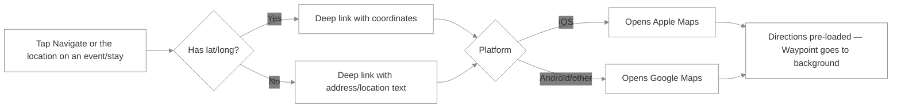
```mermaid
%%{init: {'theme': 'base', 'themeVariables': {'primaryColor': 'transparent', 'clusterBkg': 'transparent', 'primaryBorderColor': '#888888', 'clusterBorder': '#888888', 'lineColor': '#888888', 'primaryTextColor': '#333333'}}}%%
flowchart LR
    A[Tap Navigate or the location on an event/stay] --> B{Has lat/long?}
    B -->|Yes| C[Deep link with coordinates]
    B -->|No| D[Deep link with address/location text]
    C --> E{Platform}
    D --> E
    E -->|iOS| F[Opens Apple Maps]
    E -->|Android/other| G[Opens Google Maps]
    F --> H[Directions pre-loaded — Waypoint goes to background]
    G --> H
```
*This exits Waypoint entirely — it's a native map deep link, not an in-app map screen. No lat/long (e.g. Free Time's general area) falls back to a text query instead of coordinates.*

**Adding an event auto-proposes the commute** (Next Steps, not MVP)
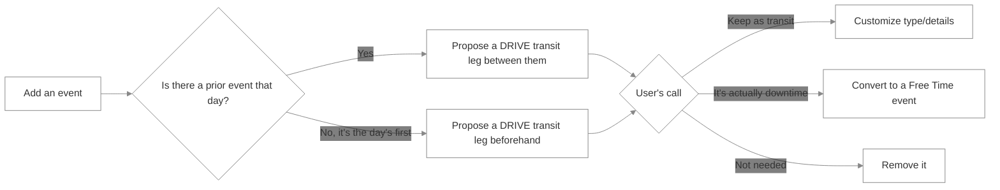
```mermaid
%%{init: {'theme': 'base', 'themeVariables': {'primaryColor': 'transparent', 'clusterBkg': 'transparent', 'primaryBorderColor': '#888888', 'clusterBorder': '#888888', 'lineColor': '#888888', 'primaryTextColor': '#333333'}}}%%
flowchart LR
    A[Add an event] --> B{Is there a prior event that day?}
    B -->|Yes| C[Propose a DRIVE transit leg between them]
    B -->|No, it's the day's first| D[Propose a DRIVE transit leg beforehand]
    C --> E{User's call}
    D --> E
    E -->|Keep as transit| F[Customize type/details]
    E -->|It's actually downtime| G[Convert to a Free Time event]
    E -->|Not needed| H[Remove it]
```
*Defaults to driving since that's the most common case, but downtime between events (no real travel happening) is just as common — converting straight to Free Time needs to be as easy as accepting the default, not just delete-or-keep. The total-travel-time rollup this would have fed is a separate, Stretch-tier idea — see Timeline above.*

**Paid early**

An expected expense row offers "I paid early" to anyone in its split: pick who you paid (pills, search past 12 people), the amount (capped at your share; an estimate defaults to the share of its minimum), Save. The Dues summary opens with a notice about your own early payments; the pair sheet adds a "paid early" block (Got it back, Remove) and "How the net adds up". When the recipient pays the expense it covers the sender's share and any excess stays owed back.

**Copy as Markdown.** The trip menu's "Copy trip as Markdown" (every member sees it) copies the whole itinerary; the Timeline's "Copy" button beside View options copies only the timeline. Both toast once the text is on the clipboard and ignore the view options and filters.

**Trip city and weather.** Creating a trip has an optional "Where is it based?" city search (it sets the time zone too); "Set city" / "Change city" in the trip menu edits it, and the city shows under the title on the trip card and in the header. A day's weather follows where its plans are: the trip city only fills days with no located plan, a day entirely elsewhere shows that place (the card names it), and a day spanning places shows the main place with "Also <place> ☁ 61°" chips, the place named under each weather strip tile with a "+1 more" marker and a "+1" on the compact line; an event in a different place than its day names that place on its chip. Tapping any weather card opens its details sheet (with an "Also on this day" list), whose one button ("Sounds good") just closes it.

**Slim timeline rows.** A day's check-ins, check-outs, rental pick-ups and returns, and its travel legs, are one-line tappable rows (a stay or rental opens read-only details, a travel leg its details with Modify), so the cards on the timeline are the plans people actually choose between.

**Personal expenses.** Above the Dues summary, "🔒 Just for me" lists what the signed-in person is covering themselves, with its own Add (title, amount, category, trip day, optional note, with "Add and mark paid" beside "Add"; its editor has "Mark paid" / "Mark as unpaid" at the top; the form says only they can see it) and a search from 8 rows. Nobody else sees the list or the amounts. The totals cards keep the figures everyone sees and, for the owner, add a soft `+ $X personal` chip and a `= $Y` line beneath (only where that amount is above zero), with one muted line under the view hint saying the orange amount is theirs alone. Tapping a row edits it; the trash in the form deletes it.

**Add & split an expense**

```mermaid
%%{init: {'theme': 'base', 'themeVariables': {'primaryColor': 'transparent', 'clusterBkg': 'transparent', 'primaryBorderColor': '#888888', 'clusterBorder': '#888888', 'lineColor': '#888888', 'primaryTextColor': '#333333'}}}%%
flowchart LR
    A[Expenses tab] --> B[+ Add] --> Q[What's this expense for?]
    Q -->|An event, stay or rental| S[Linked to summary: title, category, day]
    Q -->|Something else| T[Title and category]
    S --> W[Who's this for? Everyone / Pick people / Just me]
    T --> W
    W -->|Just me| P[Same form, private, saved to Just for me]
    W --> C[How much is it? amount with Total / Per person, then optional chips: Trip day, Group, Note]
    C --> Y[Add, or Add and mark paid — Everyone means current members, split evenly]
    Y --> D[Later: Mark paid, with a pill row for who paid]
    D --> E[Optional: tap Split] --> F[Everyone / Pick people]
    F --> G[Auto-suggested even split] --> H[Adjust per person, or clear and redo]
    D --> I[List + Dues Summary update]
    H --> I
```
*Everyone-current and Everyone-including-future-members are kept as separate choices, not folded into one "Everyone" — they produce genuinely different outcomes once someone new joins after the expense exists.*
*Add and Split are genuinely two different actions now — creating the expense is the fast path with a sensible default, and Split is there for whenever the default doesn't match reality.*

**Live trip, day-of**
```mermaid
%%{init: {'theme': 'base', 'themeVariables': {'primaryColor': 'transparent', 'clusterBkg': 'transparent', 'primaryBorderColor': '#888888', 'clusterBorder': '#888888', 'lineColor': '#888888', 'primaryTextColor': '#333333'}}}%%
flowchart LR
    A[Any screen → Now / Up next pill] --> B[Tap for details] --> C[Tap map nav]
    A --> D[Post travel status]
    A --> E[Admin edits event time] --> F[ChangeBadge shown to everyone]
```

**End-of-day album reminder**
```mermaid
%%{init: {'theme': 'base', 'themeVariables': {'primaryColor': 'transparent', 'clusterBkg': 'transparent', 'primaryBorderColor': '#888888', 'clusterBorder': '#888888', 'lineColor': '#888888', 'primaryTextColor': '#333333'}}}%%
flowchart LR
    A[Day or trip nears its end] --> B[Reminder banner appears on Overview] --> C[Tap the album link] --> D[Opens external album to add today's photos]
```
*This was already designed at the TDD level (State Machine 7 — a plain visibility check, no push notification) but hadn't been captured as its own journey until now.*

**Remove a member**
```mermaid
%%{init: {'theme': 'base', 'themeVariables': {'primaryColor': 'transparent', 'clusterBkg': 'transparent', 'primaryBorderColor': '#888888', 'clusterBorder': '#888888', 'lineColor': '#888888', 'primaryTextColor': '#333333'}}}%%
flowchart LR
    A[Members, Admin] --> B[Select member] --> C[Remove] --> D[Confirm] --> E[Access revoked, history intact]
```

## Form Field Organization

*"Grouping: none" means a single flat form — it still uses DreamerUI's `Form` component per the Design Principles above, just without a `Disclosure`/Steps wrapper around it.*

| Entity | Initial (create) | Later (edit only) | Grouping |
|---|---|---|---|
| Trip Space | title, start/end dates (framed as estimates) | city (a search; sets the time zone when creating), destination labels, tags, currency, cover image | none |
| Timeline Event | **Step 1, what & when:** `eventType`, its sub-type (transit type; meal type, defaulted from the start time), day, departs/starts time, time zone, and for dining and activities an optional "+ Add arrival time" (before the start, with an optional note on why). **Step 2, details:** a section per type — flight/train/ferry carrier + route (the departing place *is* the location), a drive/walk/bike/scooter's "going to" (the location), dining/activity location first | end/arrival time, title (derived when left out), address, travel time (only without an end time), notes, cuisines, indoor/outdoor, hours, link kind, group, reminder, attendees — as add-detail chips; a flight's **Next leg** button saves it and reopens the form with the same airline, booking, travelers and group, departing from where it landed | **Steps** |
| Stay | name, address, official check-in/out | confirmation code, notes¹ | none |
| Checklist Item | title, category (incl. a custom "Other" option with its own label), who's on it (Everyone, Pick people, or Just me, which assigns it to the author and stays visible to all), and a "Keep it private" switch when adding for just me, so only its owner sees it | — | none |
| Expense | an optional event, stay or rental it is linked to, who it is for first (everyone, picked people pre-selected from the event's attendees, or just me for a private personal expense) (fills the title, day and category, and marks that item as paid for; an item can instead be marked "No expense needed" from the link sheet, which hides its reminder until undone from its details), title, amount (or a min-max range) with a "Price is" Total / Per person pick, currency (defaulted), day (or "Other" for none); saving an event, stay or rental offers this form, already filled in, along with a checklist item | target — Everyone (current), Everyone (incl. future), Just Me, or Specific — + auto-suggested even split, adjustable; status (paid vs. expected/upcoming) | none — Split is a distinct follow-up action, not a later *field* |
| Comment/Proposal | text (+ proposal fields) | — | none |
| Idea — Restaurant | title, link, cuisines, suggested time block(s)³, suggested day(s)³ | notes | none |
| Idea — Activity | title, link, settings (indoor/outdoor, multi-select), suggested time block(s)³, suggested day(s)³ | notes | none |
| Idea — Stay | title, link, location | criteria, perks, notes | none |
| Stay Criterion | label (the criterion itself, e.g. "Near a train station"), tier (must-have vs. nice-to-have) | — | none |
| Live Travel Status | status, note | — | none² |
| Shared Album Link | url | — | none |

¹ `plannedArrivalAt`/`plannedDepartureAt` default to the official check-in/out and are never asked on create.
² Possible exception to the forms-in-modal default — see Design Principles.
³ Time blocks are Morning/Afternoon/Evening, multi-select — an idea can genuinely fit more than one (brunch is Morning *and* Afternoon). Suggested days are specific trip days (multi-select, empty = no preference — e.g. lunch works any day), for cases like "we just arrive that evening, so it fits day 1 specifically." Both are kept as two independent lists rather than paired day+time slots, since a clean way to encapsulate the paired version didn't fall out easily. Feeds the batch "Plan itinerary from ideas" journey above: the winning idea's suggestions pre-fill a starting day/time, which the user still confirms or adjusts, not auto-commits.